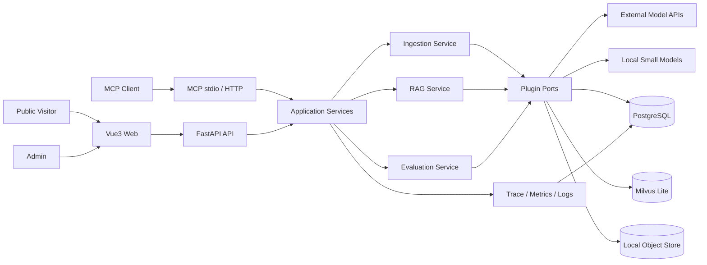

# Enterprise Agentic RAG v6 — Developer Specification

> 文档版本：0.1.0  
> 状态：Draft for implementation  
> 最后更新：2026-09-09  
> 目标仓库：`Dkpeng605/enterprise-agentic-rag-v6`  
> 本地目录：`/Users/pengdingkang/agent开发/RAG/myRAG/v6最终版`

---

## 目录

0. 文档定位与使用规则
1. 项目目标、用户与成功标准
2. 核心设计原则
3. 总体架构
4. 仓库结构
5. 核心领域模型
6. 插件系统详细设计
7. 配置与秘密管理
8. PostgreSQL 数据设计
9. 摄取流水线
10. 检索与生成流水线
11. FastAPI 接口契约
12. MCP 服务设计
13. 可观测性设计
14. 评测驱动开发体系
15. Vue3 + TypeScript 前端设计
16. 安全、鉴权与企业扩展
17. CI、PR 与发布治理
18. 公网部署设计
19. 失败模式与恢复语义
20. 逐 PR 实施清单
21. 全链路验收场景
22. 文档交付
23. 已确认决策与假设
24. 完成定义

---

## 0. 文档定位与使用规则

本文档是 v6 的单一开发规格（Single Source of Truth），用于回答以下问题：

- 为什么建设这个项目，最终交付什么；
- 每个模块负责什么、不负责什么；
- 模块之间通过什么接口通信；
- 数据如何流动、持久化、删除和恢复；
- 每个 HTTP/MCP 接口的输入、输出和错误语义；
- 前端每个页面展示什么、允许执行什么操作；
- 每个功能如何评测、何时允许合并；
- 2GB 公网服务器如何部署、监控、备份和回滚；
- 企业扩展阶段如何加入多租户、RBAC、ACL 和审计。

本文档不是旧项目的复制说明。下列材料只能作为需求证据，不是实现指令：

- `myRAG/v5最终版`：用于识别需要重新实现的用户能力；
- `/Users/pengdingkang/newrag/start/DEV_SPEC.md`：用于参考文档覆盖面；
- `/Users/pengdingkang/newrag/MODULAR-RAG-MCP-SERVER`：不得复制其中代码；
- `resume.html`：用于核对曾经描述过的产品能力，旧评测数字不构成 v6 基线。

若本文档与旧资料冲突，以本文档和后续经 PR 审核的 ADR 为准。任何接口、数据结构、状态机或部署拓扑的实质变化，都必须先更新本文档或新增 ADR，再修改代码。

### 0.1 术语

| 术语 | 定义 |
|---|---|
| Document | 用户上传的逻辑文档，同一文档可有多个版本 |
| DocumentVersion | 一次不可变的文件内容版本，以 SHA-256 标识 |
| Root | 可供回答恢复的较完整上下文单元，如 PDF 页、章节、表格行块 |
| Leaf | 用于向量化和召回的细粒度检索单元，必须隶属于 Root |
| Projection | PostgreSQL 事实数据在 Milvus 中的可重建检索副本 |
| Collection | 文档的业务分组和检索范围，不等同于 Milvus collection |
| QueryPlan | 查询改写、子问题、Scope 和待覆盖信息点的结构化计划 |
| Standard | 单轮检索后直接生成的低时延模式 |
| Deep | 带证据判断、增量恢复、验证与修复的高可靠模式 |
| Recovery | 针对证据缺口发起的额外检索动作 |
| Trace | 一次 query/ingestion/evaluation 的全链路记录 |
| EDD | Evaluation-Driven Development，先定义可判定的行为和评测，再实现 |
| Provider | 某个插件接口的具体实现，如本地 Embedding 或远程 API |

### 0.2 需求等级

- **MUST**：缺失即不能验收或上线；
- **SHOULD**：默认实现，只有 ADR 说明理由后才能推迟；
- **MAY**：可选扩展，不阻塞当前里程碑；
- **WON'T NOW**：本轮明确不做，防止范围失控。

---

## 1. 项目目标、用户与成功标准

### 1.1 产品目标

从零实现一个面向学习、面试展示和小规模公网演示的企业知识库 Agentic RAG 平台。系统必须同时具备：

1. 多格式企业文档摄取；
2. Root/Leaf 分层索引；
3. Dense + Sparse + RRF + Rerank 检索；
4. QueryPlan、Standard/Deep 和自适应 Recovery；
5. 可替换的全链路组件；
6. FastAPI REST/SSE 服务；
7. stdio 与 Streamable HTTP MCP 服务；
8. Vue3 + TypeScript 可视化管理与公共问答；
9. Query/Ingestion/Evaluation 可观测性；
10. 低成本、可重复的评测闭环；
11. 匿名单租户测试工作区与受保护系统管理面的公网部署；
12. 最后阶段的多租户、RBAC、文档 ACL 和审计。

### 1.2 目标用户

| 用户 | 主要任务 | 默认权限 |
|---|---|---|
| 匿名测试者 | 在隔离、可重置的 demo tenant 中测试完整业务链路 | 单租户业务管理权限、受配额限制 |
| 系统管理员 | 管理系统配置、身份、Token、恢复任务和 Provider | 系统级权限 |
| MCP 用户 | 从 IDE/桌面 Agent 查询被授权集合 | Token Scope 限定 |
| 企业租户管理员 | 管理本租户用户、集合和 Token | 仅本租户 |
| 企业编辑者 | 上传、更新和删除授权集合文档 | 无用户管理权限 |
| 企业查看者 | 查询与查看授权文档 | 只读 |

### 1.3 可验证的成功标准

- 新开发者仅依赖 README，在 15 分钟内可启动 mock/local 开发环境；
- 所有 Provider 都通过同一套契约测试，切换 Provider 不修改业务代码；
- 上传支持格式后可查询任务状态，重复内容不会重复索引；
- Standard 与 Deep 均返回结构化引用，证据不足时不会无依据确定性回答；
- MCP stdio 和 HTTP 对同一问题返回等价结构；
- Dashboard 能定位每次检索的 Dense/Sparse/RRF/Rerank 排名变化；
- 小型 golden set 达到本文件定义的合并阈值；
- 公网匿名用户可在 demo tenant 内测试集合、文档、摄取、查询、Trace 和评测，不能访问系统级管理能力；
- 2GB VPS 在资源限制内持续运行，服务异常后能恢复未完成任务；
- 每项功能通过独立 PR 合并，`main` 始终可安装、可测试或明确处于文档阶段。

### 1.4 非目标

本轮不实现：

- Milvus Distributed、Kubernetes 或跨区域高可用；
- 通用网页爬虫、登录态网页抓取；
- 手写体 OCR、复杂图表数值还原；
- 在线模型训练或微调平台；
- 计费系统和商业支付；
- 与云厂商 IAM 的深度绑定；
- 完整 DLP、SIEM、SOC2 合规认证；
- 每个 PR 执行 4201 条问题的昂贵公开评测。

### 1.5 v5 能力迁移矩阵

“保留 v5 功能”指重新实现下列外部行为，不复制 v5 内部代码：

| v5 可见能力 | v6 对应设计 | 验收位置 |
|---|---|---|
| PDF/DOCX/XLSX/XLS/CSV/HTML/TXT/MD | 独立 Loader + 统一 Root | M3-01～M3-03 |
| 扫描 PDF 中英文 OCR | PDF 文本阈值 + Tesseract fallback | M3-01 |
| SHA-256 增量摄取 | DocumentVersion + 并发去重 | M2-05、M3-09 |
| PostgreSQL 事实源 | async Repository + 状态机 | M2-01～M2-02 |
| Milvus Leaf 投影 | VectorStore Adapter + count verify | M2-03、M3-08 |
| Root/Leaf 分层索引 | 稳定 ID、Leaf 召回、Root 恢复 | M3-05、M4-04 |
| Dense + BM25 + RRF | 双路召回与确定性融合 | M4-01～M4-02 |
| CrossEncoder Rerank | 本地/HTTP/Noop Reranker | M4-03 |
| QueryPlan 与 Scope | 结构化 Planner + 授权 Scope | M4-05 |
| Standard/Deep | 两条共享检索的状态图 | M4-06～M4-08 |
| 自适应 Recovery | Rewrite/HyDE/BM25/Scope repair | M4-07 |
| 引用、验证和修复 | Citation + Verify + Repair | M4-08～M4-09 |
| 上传/状态/删除 API | FastAPI 文档生命周期接口 | M3-10 |
| 同步查询与 SSE | REST + 固定 SSE Event Schema | M4-09 |
| reconcile | 跨存储报告与显式修复 | M2-06 |
| 小型评测和模式比较 | EDD Runner + 可比较报告 | M6-01～M6-05 |
| MultiDoc2Dial 公开评测能力 | 隔离的可选 Benchmark Adapter | M6-06 |

v6 新增的插件、MCP、Vue 管理台、可观测性、鉴权、部署和企业隔离能力，不能以删除上述行为为代价。

---

## 2. 核心设计原则

### 2.1 事实源与投影分离

PostgreSQL 是唯一业务事实源。Milvus 只保存可重建 Leaf 投影。查询命中 Milvus 后必须回 PostgreSQL校验：

- 文档状态是否为 `ready`；
- 文档、集合和租户是否仍有效；
- 当前调用方是否拥有访问权限；
- Root 内容是否存在且版本匹配。

禁止依赖 Milvus 中的文本作为最终权限判断或唯一恢复来源。

### 2.2 接口优先而不是工厂堆砌

可插拔不等于给每个类加一个 Factory。每个插件必须满足：

- 有稳定、最小、与供应商无关的接口；
- 有能力描述 `capabilities()`；
- 有统一异常类型；
- 有契约测试；
- 有明确生命周期和资源释放；
- 配置切换后可通过诊断接口确认实际 Provider；
- Provider 不可用时，只有规格允许的节点才能降级。

### 2.3 评测先于优化

任何影响切分、Embedding、检索、融合、Rerank、Prompt、Evidence Gate 的 PR，必须至少新增或更新一个能体现目标变化的评测用例。没有数据证据时不得声称“提升准确率”。

### 2.4 默认安全

- 匿名用户自动绑定唯一、可重置的 demo tenant，可操作该租户的集合、文档、摄取、查询、Trace 和受预算评测；
- 匿名写操作需要服务端签发的匿名会话和 CSRF 防护，但不要求注册或登录；
- Provider 密钥、系统设置、用户、Token、备份恢复和部署能力始终需要系统管理员认证；
- 密钥只来自环境变量或 Secret；
- 日志和 Trace 默认不记录密钥、Authorization、完整文档正文或原始 IP；
- 上传文件先校验大小、扩展名、MIME signature，再进入解析器；
- 所有租户过滤必须在检索前执行，并在 PostgreSQL 回源时二次执行。

### 2.5 明确降级

允许的默认降级：

| 组件故障 | 降级行为 | 是否告警 |
|---|---|---|
| Reranker | 使用 RRF 排名，响应标记 `rerank_degraded=true` | 是 |
| Vision Caption | 保留图片引用，不生成 caption | 是 |
| LLM Evidence Assessor | 使用确定性阈值路由 | 是 |
| Answer Verifier | 返回已生成答案并标记 `verification_skipped` | 是 |
| Trace Exporter | 业务继续，写入结构化错误日志 | 是 |

禁止降级：Embedding 维度变化、PostgreSQL 不可用、Milvus 查询不可用、权限校验失败、配置无效。这些情况必须返回明确错误或拒绝服务。

---

## 3. 总体架构



### 3.1 分层约束

| 层 | 可依赖 | 禁止依赖 |
|---|---|---|
| Domain | Python 标准库、纯类型 | FastAPI、SQLAlchemy、Milvus、供应商 SDK |
| Application | Domain、Ports | 具体 Adapter、HTTP Request 对象 |
| Ports | Domain 类型 | 具体实现 |
| Adapters | Ports、第三方 SDK | API 路由 |
| API/MCP | Application、Schema | 直接执行 SQL 或直接调用 Milvus |
| Frontend | OpenAPI Client、UI 模块 | 数据库与后端内部模型 |

依赖注入由 Composition Root 完成。业务服务禁止在方法内部读取全局配置或自行创建 Provider。

### 3.2 运行进程

公网 2GB Profile：

1. `caddy`：TLS、静态前端、反向代理；
2. `api`：一个 Uvicorn worker，包含 FastAPI、MCP HTTP 和后台 Job Runner；
3. `postgres`：事实数据、任务、Trace、评测、鉴权；
4. Milvus Lite 嵌入 `api` 进程，通过唯一客户端持有数据目录。

开发 Profile 可额外启动本地模型，但生产 Profile 禁止加载本地 Torch 模型。stdio MCP 作为独立本地进程运行时使用自己的开发数据目录，不能与正在运行的 API 共享同一个 Milvus Lite 文件。

### 3.3 资源预算

| 服务 | 目标内存 | 硬限制 | 说明 |
|---|---:|---:|---|
| Caddy | 30–60MB | 96MB | TLS 与静态资源 |
| FastAPI + Milvus Lite | 350–700MB | 896MB | 不加载本地模型 |
| PostgreSQL | 180–350MB | 512MB | 小规模连接池和缓存 |
| 系统与页缓存 | 400–700MB | 不设置 | 必须保留余量 |

VPS SHOULD 配置 2GB swap 作为 OOM 缓冲，但 swap 不能作为正常容量。容器内构建、模型下载和全量评测不得在生产 VPS 执行。

---

## 4. 仓库结构

```text
enterprise-agentic-rag-v6/
├── DEV_SPEC.md
├── README.md
├── README.en.md
├── LICENSE
├── .env.example
├── .github/
│   ├── pull_request_template.md
│   └── workflows/
│       ├── backend.yml
│       ├── frontend.yml
│       ├── integration.yml
│       ├── images.yml
│       └── deploy.yml
├── backend/
│   ├── pyproject.toml
│   ├── uv.lock
│   ├── alembic.ini
│   ├── migrations/
│   ├── src/enterprise_rag/
│   │   ├── domain/
│   │   ├── application/
│   │   ├── ports/
│   │   ├── adapters/
│   │   ├── api/
│   │   ├── mcp/
│   │   ├── observability/
│   │   └── bootstrap.py
│   └── tests/
│       ├── unit/
│       ├── contract/
│       ├── integration/
│       └── e2e/
├── frontend/
│   ├── package.json
│   ├── pnpm-lock.yaml
│   ├── vite.config.ts
│   ├── src/
│   │   ├── api/
│   │   ├── components/
│   │   ├── features/
│   │   ├── layouts/
│   │   ├── router/
│   │   ├── stores/
│   │   └── views/
│   └── tests/
├── evals/
│   ├── datasets/
│   ├── fixtures/
│   └── reports/.gitkeep
├── infra/
│   ├── compose/
│   ├── caddy/
│   ├── scripts/
│   └── backup/
├── docs/
│   ├── adr/
│   ├── architecture/
│   ├── api/
│   ├── deployment/
│   └── learning/
└── scripts/
```

测试 fixture、schema 和小型 golden set 可以提交。上传文件、模型权重、真实密钥、运行数据库、Trace 内容和评测产物不得提交。

---

## 5. 核心领域模型

所有时间使用带时区 UTC，API 输出 ISO 8601。所有 ID 使用 UUIDv7 字符串；内容 ID 可使用带类型前缀的 SHA-256 派生值。

### 5.1 文档模型

```python
Document:
  id: UUID
  tenant_id: UUID
  collection_id: UUID
  logical_name: str
  title: str
  status: pending | processing | ready | failed | deleting | deleted
  active_version_id: UUID | None
  visibility: private | tenant | public
  created_by: UUID
  created_at: datetime
  updated_at: datetime

DocumentVersion:
  id: UUID
  document_id: UUID
  sha256: str
  source_name: str
  media_type: str
  size_bytes: int
  object_key: str
  parser_provider: str
  parser_version: str
  status: pending | processing | indexed | failed | superseded | deleted
  error_code: str | None
  error_message: str | None
```

去重判定键固定为 `(tenant_id, collection_id, sha256)`：同一范围重复上传返回首次创建的 document/version；相同逻辑名和新摘要为现有 document 创建新 version；相同内容上传到不同 Collection 或不同租户时复用不可变文件对象，但创建独立 document/version 和 content claim，避免权限串联。并发注册必须在 PostgreSQL 事务内同时获取内容键与逻辑文档键的 advisory lock，按稳定顺序加锁并由唯一约束兜底。

### 5.2 Root 与 Leaf

```python
RootChunk:
  id: str
  tenant_id: UUID
  document_id: UUID
  version_id: UUID
  ordinal: int
  kind: page | section | sheet_rows | text_block
  source_locator: dict
  raw_text: str
  clean_text: str
  metadata: dict
  content_hash: str

LeafChunk:
  id: str
  root_id: str
  tenant_id: UUID
  document_id: UUID
  version_id: UUID
  ordinal: int
  text: str
  retrieval_text: str
  start_offset: int | None
  end_offset: int | None
  token_count: int
  metadata: dict
  content_hash: str
```

Root/Leaf ID 必须稳定：同一版本使用相同解析器和切分配置重跑时 ID 不变。切分算法或关键配置变化必须生成新的 `index_revision`，禁止覆盖旧 revision 后假装可比较。

### 5.3 查询模型

```python
QueryPlan:
  original_query: str
  rewritten_query: str
  intent: factual | comparison | procedural | summary | exploratory
  sub_queries: list[str]
  requirements: list[str]
  scope: QueryScope
  language: str
  mode: standard | deep

QueryScope:
  collection_ids: list[UUID]
  document_ids: list[UUID]
  titles: list[str]
  organizations: list[str]
  doc_types: list[str]
  versions: list[str]
  sections: list[str]

RetrievalHit:
  leaf_id: str
  root_id: str
  dense_rank: int | None
  sparse_rank: int | None
  fused_score: float
  rerank_score: float | None
  selected: bool

Citation:
  id: int
  document_id: UUID
  root_id: str
  chunk_ids: list[str]
  source_name: str
  title: str
  page: int | None
  section: str | None
  quote: str
  score: float | None
```

### 5.4 统一错误模型

```json
{
  "error": {
    "code": "DOCUMENT_UNSUPPORTED_TYPE",
    "message": "The uploaded file type is not supported.",
    "request_id": "019...",
    "details": {"media_type": "application/octet-stream"}
  }
}
```

错误码使用稳定大写枚举。内部堆栈、SQL、文件绝对路径和供应商响应正文不得返回客户端。

---

## 6. 插件系统详细设计

### 6.1 通用 Provider 元数据

```python
ProviderInfo:
  kind: str
  name: str
  version: str
  capabilities: frozenset[str]
  is_remote: bool
  health: healthy | degraded | unavailable | unknown
```

注册表键为 `(kind, name)`。重复注册必须启动失败。配置指定不存在 Provider 必须启动失败。Provider 创建后由应用生命周期统一关闭。

### 6.2 Loader

```python
class Loader(Protocol):
    def info(self) -> ProviderInfo: ...
    def supports(self, media_type: str, suffix: str) -> bool: ...
    async def load(self, source: BinarySource, ctx: IngestionContext) -> list[LoadedRoot]: ...
```

约束：

- Loader 只负责解析和结构定位，不负责切 Leaf、Embedding 或写数据库；
- 输出顺序稳定；
- 空内容必须返回 `DOCUMENT_EMPTY`，不能生成空 Root；
- 每个 Root 必须有可读 locator；
- 解析第三方库异常映射为统一错误；
- 临时文件必须在成功和失败路径清理。

### 6.3 Cleaner 与 Splitter

```python
class Cleaner(Protocol):
    async def clean(self, root: LoadedRoot, ctx: IngestionContext) -> CleanResult: ...

class Splitter(Protocol):
    async def split(self, root: CleanRoot, ctx: IngestionContext) -> list[LeafDraft]: ...
```

`CleanResult` 必须保留 raw text、clean text 和逐项报告。默认 Cleaner 只执行确定性规则：NUL、不可见控制字符、空白、重复页眉页脚和 OCR 异常归一化。默认摄取不调用 LLM 改写原文。

默认 Splitter 先尊重标题、段落、列表、代码块、表格行边界，再应用 token 上限。参数：

- `target_tokens=350`；
- `max_tokens=480`；
- `overlap_tokens=50`；
- 单个超长无空格 token 必须硬切；
- overlap 不得跨 Root；
- 表格头在每个续块中重复，便于独立理解。

### 6.4 Embedding

```python
class EmbeddingProvider(Protocol):
    @property
    def dimension(self) -> int: ...
    async def embed_documents(self, texts: Sequence[str]) -> list[list[float]]: ...
    async def embed_query(self, text: str) -> list[float]: ...
```

要求：

- 返回数量必须等于输入数量；
- 每个向量维度固定且为有限数；
- 入库前记录模型名、revision、维度和归一化策略；
- Provider 或维度变化必须创建新 collection/revision 并重建，不能混写；
- 批处理按最大条数与最大 token 双重切分；
- 远程 API 使用超时、指数退避和最大重试，不重试鉴权与参数错误。

### 6.5 VectorStore

```python
class VectorStore(Protocol):
    async def ensure_revision(self, schema: IndexSchema) -> None: ...
    async def upsert(self, records: Sequence[VectorRecord]) -> UpsertResult: ...
    async def dense_search(self, request: DenseSearchRequest) -> list[VectorHit]: ...
    async def sparse_search(self, request: SparseSearchRequest) -> list[VectorHit]: ...
    async def delete_by_version(self, tenant_id: UUID, version_id: UUID) -> int: ...
    async def count_by_version(self, tenant_id: UUID, version_id: UUID) -> int: ...
```

Milvus 字段必须包含 tenant、collection、document、version、root、leaf、status、dense vector、sparse vector和最小诊断元数据。正文权威副本留在 PostgreSQL。

所有搜索必须包含 tenant filter。匿名请求被强制绑定到系统配置的 demo tenant，不能通过参数切换 tenant；可搜索该租户内全部未删除集合。`top_k` 最大 50。

### 6.6 ObjectStore

```python
class ObjectStore(Protocol):
    async def put(
        self,
        chunks: AsyncIterable[bytes],
        *,
        expected_sha256: str | None = None,
        max_bytes: int | None = None,
    ) -> StoredObject: ...
    def read(self, key: str, *, chunk_size: int = 65536) -> AsyncIterator[bytes]: ...
    async def exists(self, key: str) -> bool: ...
    async def delete(self, key: str) -> bool: ...
    async def list_keys(self) -> tuple[str, ...]: ...
```

本地实现的对象键固定为 `sha256/{前两位}/{次两位}/{64 位小写摘要}`，不得接受文件名、绝对路径、`..` 或非规范摘要作为键。写入期间仅允许在存储根目录内的 `temporary/*.part` 可见；完整流写入并 `fsync`、校验可选期望摘要和大小上限后，使用同文件系统硬链接原子发布。发布目标已存在时不得覆盖，必须验证已有文件的大小与 SHA-256 后返回 `created=false`。异常、取消、摘要不符和超限都必须清除临时文件。`delete` 幂等，`list_keys` 只返回通过规范键校验的对象，供 reconcile 使用。`mutation_guard` 在单进程 Local Adapter 内串行化“对象发布 + 数据库引用提交”和“引用核验 + 对象删除”，避免去重注册与清理竞态；多进程部署必须更换支持分布式互斥的 Adapter。

### 6.7 Reranker 与 LLM

```python
class Reranker(Protocol):
    async def rerank(self, query: str, candidates: Sequence[RerankCandidate], top_k: int) -> list[RerankResult]: ...

class LLMProvider(Protocol):
    async def complete(self, request: CompletionRequest) -> CompletionResult: ...
    async def stream(self, request: CompletionRequest) -> AsyncIterator[CompletionDelta]: ...
```

远程 Rerank 适配层将供应商差异限制在 Adapter 内。业务层只接收与候选 ID 对齐的分数。缺失、重复或未知候选 ID 视为供应商响应无效，并触发声明过的 RRF 降级。

LLM 返回必须记录 provider、model、latency、input/output token、retry count 和 finish reason，不记录 API Key。结构化输出首先使用供应商 schema/JSON mode；解析失败仅允许一次修复请求。

### 6.8 Evaluator 与 TraceExporter

```python
class Evaluator(Protocol):
    async def evaluate(self, case: EvalCase, result: QueryResult) -> MetricSet: ...

class TraceExporter(Protocol):
    async def export(self, trace: CompletedTrace) -> None: ...
```

Evaluator 必须声明是否需要 LLM、预计调用次数和支持指标。Eval Runner 在执行前计算预算，超过配置上限时拒绝启动。

---

## 7. 配置与秘密管理

### 7.1 配置优先级

`代码默认值 < config YAML < 环境变量 < 测试显式覆盖`。生产禁止从仓库文件读取真实密钥。

配置至少包含：

```yaml
app:
  environment: development
  public_base_url: http://localhost:8000

providers:
  llm: openai_compatible
  embedding: local_multilingual_minilm
  reranker: local_cross_encoder
  vector_store: milvus_lite
  splitter: structure_aware
  evaluator: deterministic

ingestion:
  max_upload_bytes: 104857600
  allowed_suffixes: [.pdf, .docx, .xlsx, .xls, .csv, .html, .htm, .txt, .md]
  target_tokens: 350
  max_tokens: 480
  overlap_tokens: 50
  max_attempts: 3

retrieval:
  dense_candidates: 40
  sparse_candidates: 40
  fused_candidates: 30
  rerank_candidates: 20
  selected_leaf_k: 8
  rrf_k: 60
  max_parent_chars: 18000

deep:
  max_recovery_rounds: 2
  max_answer_repairs: 1
  low_threshold: 0.45
  high_threshold: 0.80

security:
  anonymous_demo_full_access: true
  anonymous_demo_tenant_slug: demo
  anonymous_api_requests_per_minute: 10
  anonymous_queries_per_minute: 5
  anonymous_daily_llm_calls: 500
  anonymous_max_file_bytes: 20971520
  anonymous_max_ready_documents: 20
  session_minutes: 480

observability:
  capture_query_text: true
  capture_document_text: false
  trace_retention_days: 30
```

### 7.2 环境变量

至少支持：

- `DATABASE_URL`；
- `SESSION_SECRET`；
- `ADMIN_BOOTSTRAP_EMAIL`、`ADMIN_BOOTSTRAP_PASSWORD`；
- `LLM_BASE_URL`、`LLM_API_KEY`、`LLM_MODEL`；
- `EMBEDDING_BASE_URL`、`EMBEDDING_API_KEY`、`EMBEDDING_MODEL`；
- `RERANK_BASE_URL`、`RERANK_API_KEY`、`RERANK_MODEL`；
- `MCP_TOKEN_PEPPER`；
- `PUBLIC_BASE_URL`。

启动日志只显示变量是否配置，不显示值。`.env.example` 使用不可用的占位符。

---

## 8. PostgreSQL 数据设计

### 8.1 核心表

| 表 | 关键字段 | 关键约束/索引 |
|---|---|---|
| tenants | id, name, slug, status | slug unique |
| users | id, email, password_hash, status | lower(email) unique |
| memberships | tenant_id, user_id, role | pair unique |
| collections | id, tenant_id, name, visibility | tenant+name unique |
| documents | id, tenant_id, collection_id, status, active_version_id | tenant/status index |
| document_versions | id, document_id, sha256, object_key, status | document+sha unique |
| document_content_claims | tenant_id, collection_id, sha256, document_id, version_id | tenant+collection+sha primary key；version unique |
| roots | id, version_id, ordinal, raw_text, clean_text, metadata | version+ordinal unique |
| leaves | id, root_id, ordinal, text, retrieval_text, metadata | root+ordinal unique |
| ingestion_jobs | id, type, status, attempts, lease_owner, lease_until | status+available_at index |
| index_revisions | id, provider, model, dimension, config_hash, status | active revision partial unique |
| query_runs | id, tenant_id, actor_id, mode, status, usage | started_at index |
| trace_spans | id, trace_id, parent_span_id, name, timing, attributes | trace+start index |
| eval_datasets | id, tenant_id, name, version, checksum | tenant+name+version unique |
| eval_runs | id, dataset_id, config_snapshot, status, metrics | created_at index |
| api_tokens | id, tenant_id, token_hash, scopes, expires_at | token prefix index |
| rate_limits | bucket_key, window_start, count | composite primary key |
| audit_events | id, tenant_id, actor_id, action, target, payload | tenant+created index |

### 8.2 状态机

文档：

```text
pending -> processing -> ready
                    \-> failed
ready -> processing (new version)
ready|failed -> deleting -> deleted
```

任务：

```text
queued -> leased -> running -> succeeded
                         \-> retry_wait -> leased
                         \-> failed
queued|retry_wait -> cancelled
```

状态转换通过 Repository 的条件更新执行，禁止 API 直接赋值。`ready` 只能在 PostgreSQL 内容写入、Milvus upsert 和数量核验都成功后设置。

### 8.3 一致性策略

系统不做跨 PostgreSQL/Milvus 分布式事务，采用 Saga：

1. 创建 version/job；
2. 解析并在单个 PostgreSQL 事务写 Root/Leaf，version=`processing`；
3. upsert Milvus；
4. 按 version 核验数量；
5. 将 version 和 document 标为 ready；
6. 失败时删除该 version 的 Milvus 投影并保留错误记录。

查询只接受 PostgreSQL `ready` version。reconcile 扫描：孤儿向量、缺失向量、数量不一致、超期 lease、无对象文件版本和无数据库记录对象文件。

删除采用可重入 Saga：请求事务先将 document 改为 `deleting`、清空 active version、取消或请求取消摄取任务并创建 delete job，使查询立即不可见；worker 再依次删除全部 version 的 Milvus 投影、Root/Leaf 与 content claim、无其他活跃引用的对象文件，最后把 version/document 写为 `deleted` tombstone 并完成 job。每一步都可重复，跨存储调用之间不宣称原子性。

reconcile 默认只读。`--apply` 仅自动删除数据库已无引用的向量/对象并回收超期 lease；缺失对象和向量数量不一致需要源内容或重新 embedding，必须报告但不得猜测性重建。扫描向量时先读 Projection 再读 PostgreSQL，清理对象时在 ObjectStore mutation guard 内重新读取数据库引用，避免把并发新注册资源误判为孤儿。

---

## 9. 摄取流水线

### 9.1 上传前检查

- 文件名只用于展示，存储键不使用用户文件名；
- 校验最大 100MB，可按环境降低；
- 扩展名、声明 MIME 和 magic bytes 必须一致；
- 拒绝可执行文件、压缩炸弹、加密文档和路径穿越名称；
- 上传流写临时文件并同步计算 SHA-256，禁止一次性读入内存；
- 临时文件写完后原子移动到对象目录；
- 重复上传返回已有 document/version，并设置 `deduplicated=true`。

### 9.2 各格式解析语义

#### PDF

- 每页默认一个 Root；极长页按段落拆 Root，但保留页码；
- 首先提取文本，低于 `pdf_ocr_min_chars` 的页面调用 Tesseract；
- OCR 默认语言 `chi_sim+eng`，缺失语言包时扫描页任务失败，不能静默跳过；
- 提取图片时记录页码、bbox、mime、object key 和 hash；
- 密码保护 PDF 返回 `DOCUMENT_ENCRYPTED`；
- 页码对外使用 1-based。

#### DOCX

- 按 Heading 层级形成 Root；无标题段落归入最近标题；
- 表格转为 Markdown table，合并单元格保留可读文本；
- 图片形成引用，不擅自推断内容；
- 页码不可可靠获得时返回 section，不伪造页码。

#### XLSX/XLS/CSV

- 每个 worksheet 独立处理；
- Root 是带表头的行块，默认最多 60 行；
- 每个续块重复表头；
- 公式默认读取缓存值，同时在 metadata 标记 formula；
- 空行列裁剪，但不得改变有效单元格顺序；
- CSV 探测 UTF-8/UTF-8-SIG，失败后按明确配置回退，不盲目猜测所有编码。

#### HTML

- 只解析上传的 HTML 文件，不抓 URL；
- 移除 script/style/nav 等非正文区域；
- 标题、段落、列表、代码和表格转为规范 Markdown；
- 不执行脚本，不请求外部资源。

#### TXT/Markdown

- 保留标题、列表、代码块结构；
- Markdown 中本地图片只在上传包内存在且通过安全路径校验时关联；
- 远程图片默认不下载。

### 9.3 进度事件

摄取任务按阶段报告：

```text
validating 0-5%
parsing 5-30%
cleaning 30-40%
splitting 40-55%
enriching 55-65%
embedding 65-82%
persisting 82-90%
indexing 90-98%
verifying 98-100%
```

进度只能单调增加。失败事件包含 stage、error_code 和可安全展示的信息。

### 9.4 幂等和取消

- 每个阶段使用 version ID 和 config hash 作为幂等键；
- 取消只在阶段边界生效；
- 已写 PostgreSQL 但未 ready 的数据不可查询；
- 重试不得生成重复 Root/Leaf；
- 删除与摄取冲突时，删除优先，摄取在下一检查点取消。

---

## 10. 检索与生成流水线

### 10.1 QueryPlan

Planner 输入问题、模式、授权集合目录和有限历史，输出严格 JSON。规则：

- 原始问题不得丢失；
- 最多 6 个 sub-query；
- comparison/multi-condition 必须拆 requirements；
- Scope 只能引用目录中存在且调用方有权访问的值；
- LLM 返回非法 Scope 时丢弃非法值并记录诊断；
- Planner 故障时使用原问题、空 Scope、单 sub-query 的确定性计划。

### 10.2 召回

每个 sub-query 并行执行：

- Dense Top 40；
- Sparse Top 40；
- RRF 合并至 30；
- 跨 sub-query 按 leaf ID 去重；
- 同一 Root 默认最多保留 3 个 Leaf，避免单页垄断；
- Rerank 前保留首轮与 Recovery 候选来源。

RRF：`score(d) = Σ 1 / (rrf_k + rank_i(d))`，默认 `rrf_k=60`。排名从 1 开始。Dense/Sparse 原始分数只用于诊断，不直接相加。

### 10.3 Rerank 与 Root 恢复

- Rerank 输入 query 与候选 retrieval text；
- 默认重排 Top 20，选择 Top 8 Leaf；
- Rerank 结果必须与候选 ID 一一对应；
- 选中 Leaf 后按 Root ID 恢复完整上下文；
- Root 总字符数默认上限 18000，优先保留高分 Root；
- 同一 Root 多个命中合并为一个引用，但保留命中 Leaf 列表。

### 10.4 Standard 模式

```text
plan -> retrieve -> rerank -> restore roots -> answer -> citations -> finalize
```

- 不执行 Recovery；
- Planner 降级后仍可回答；
- 无有效 Root 时直接拒答；
- 目标 LLM 调用：Planner 1 次、Answer 1 次；
- 输出包含 diagnostics 和 usage，但公共前端默认隐藏内部诊断。

### 10.5 Deep 模式

```text
plan -> retrieve -> assess evidence
  -> sufficient: answer -> verify -> finalize
  -> insufficient: recover -> retrieve increment -> assess
  -> max rounds: abstain or answer with explicit gaps
```

EvidenceAssessment：

```python
EvidenceAssessment:
  score: float
  covered_requirements: list[str]
  missing_requirements: list[str]
  conflicts: list[str]
  route: answer | recover | abstain
  reason: str
```

双阈值：高于 0.80 直接回答；低于 0.45 直接 Recovery；中间区间允许 LLM Assessor。最多两轮 Recovery，每轮必须针对缺口，禁止原样重复首轮查询。

### 10.6 Recovery 路由

| 缺口 | 路由 | 行为 |
|---|---|---|
| 同义表达/召回不足 | Query Rewrite Hybrid | 改写后 Dense+Sparse |
| 概念描述性问题 | HyDE Dense-only | 生成假设答案，仅用于 Dense 查询 |
| 型号、编号、精确术语 | Sparse-only | 保留原始关键词；当前 hashing lexical 不冒充 BM25，可替换为 BM25 Provider |
| Scope 冲突或过窄 | Scope repair | 只放宽被证明错误的 Scope |

Recovery 结果与现有 Evidence Ledger 按 Leaf ID 去重。每轮至少为 Recovery 候选预留两个最终名额，避免被首轮大量候选完全挤出。

### 10.7 Answer、验证与引用

- Prompt 明确要求只依据给定 Root；
- 每个事实性段落必须能映射至少一个 Citation；
- Citation quote 必须是 Root 中存在的短片段；
- Verifier 检查事实覆盖、引用存在、矛盾和未回答 requirement；
- 最多一次 Repair，Repair 不允许引入新证据；
- 无法修复时返回有边界的答案并列出缺失信息；
- 不向用户暴露隐藏推理过程，只返回简短决策原因和证据。

### 10.8 对话历史

- 最多接收最近 12 条 user/assistant 消息；
- 历史用于指代消解，不直接作为事实证据；
- 历史总字符上限 12000；
- 服务端不默认永久保存匿名会话正文；
- 管理员可查看经过保留策略处理的 query run。

---

## 11. FastAPI 接口契约

统一前缀 `/api/v1`。分页使用 cursor，不使用大 offset。所有响应包含 `request_id` header。

### 11.1 鉴权

#### `POST /auth/login`

输入：email、password。成功后设置 HttpOnly、Secure、SameSite=Lax session cookie，并返回用户与租户摘要。登录失败统一返回 401，不泄露用户是否存在。

#### `POST /auth/logout`

撤销服务端 session 并清除 cookie。必须携带 CSRF token。

#### `GET /auth/me`

当匿名 demo 开启时，无 Cookie 请求会创建匿名 session，并返回 `actor_type=anonymous`、固定 demo tenant、`demo_operator` 权限和 CSRF token；关闭匿名 demo 时，未登录返回 401。系统管理员登录后返回用户、租户、系统权限和新的 CSRF token。

### 11.2 集合

- `POST /collections`：匿名测试者可在 demo tenant 创建集合；
- `GET /collections`：列出当前 Principal 可见集合；
- `GET /collections/{id}`：返回统计和最近活动；
- `PATCH /collections/{id}`：修改名称、描述和 demo 内可见性；
- `DELETE /collections/{id}`：异步删除集合内文档，必须二次确认字段；
- demo tenant 至少保留一个系统 seed collection，该集合可恢复但不能永久删除。

### 11.3 文档

#### `POST /documents`

`multipart/form-data`：file、collection_id、title、organization、visibility。新任务返回 202：

```json
{
  "document_id": "...",
  "version_id": "...",
  "job_id": "...",
  "deduplicated": false,
  "status": "pending"
}
```

#### `GET /documents`

支持 collection、status、type、keyword、cursor、limit；默认 limit 20，最大 100。

#### `GET /documents/{id}`

返回文档、版本、Root/Leaf 统计和最近任务，不默认返回全部正文。

#### `DELETE /documents/{id}`

返回 202 和 delete job。重复删除返回同一进行中任务或已删除状态。

#### `GET /ingestion-jobs/{id}`

返回阶段、进度、attempts、时间和安全错误信息。只有所属租户可以读取。

### 11.4 查询

```json
POST /query
{
  "question": "...",
  "mode": "standard",
  "collection_ids": ["..."],
  "history": [{"role": "user", "content": "..."}],
  "include_diagnostics": false
}
```

同步响应包含 answer、citations、mode、trace_id、usage、degraded flags。匿名用户的 collection_ids 会被强制限制为 demo tenant 中存在的集合。

`POST /query/stream` 使用 SSE：

| 事件 | 主要字段 |
|---|---|
| accepted | trace_id, mode |
| stage | name, status, elapsed_ms |
| token | delta |
| citation | citation |
| completed | answer, citations, usage, degraded |
| error | code, message, request_id |

客户端断开后取消尚未开始的 LLM 调用；已完成检索 Trace 仍可落库。SSE 每 15 秒发送注释 heartbeat。

### 11.5 CLI 契约

CLI 与 HTTP/MCP 必须调用同一 Application Service，禁止出现独立业务实现。统一入口为 `uv run enterprise-rag`：

| 命令 | 作用 | 退出码 |
|---|---|---:|
| `serve` | 启动 FastAPI、HTTP MCP 和 Job Runner | 启动失败为 1 |
| `mcp-stdio` | 启动本地 stdio MCP | 协议/配置失败为 1 |
| `db upgrade` | 执行 Alembic upgrade | 迁移失败为 1 |
| `doctor` | 检查配置、PG、Milvus、OCR、Provider | 任一 required 项失败为 1 |
| `ingest <path>` | 注册文件并等待或返回 job | 文件/任务失败为 1 |
| `query <question>` | 执行 Standard/Deep 查询 | 查询失败为 1 |
| `evaluate <dataset>` | 运行预算受控评测 | 未达门禁为 2 |
| `reconcile` | 只报告或显式修复投影差异 | 未修复差异为 2 |
| `backup` / `restore` | 执行并验证备份恢复 | 失败为 1 |

默认 stdout 输出人类可读摘要；`--json` 输出稳定 JSON，日志始终写 stderr。破坏性修复必须显式传 `--apply`，否则 reconcile 只读。

### 11.6 管理与评测

- `GET /system/overview`：Provider、文档、任务、查询和资源摘要；
- `GET /providers`：当前 Provider 与健康状态，密钥仅显示 configured；
- `GET /traces/query`、`GET /traces/ingestion`：筛选列表；
- `GET /traces/{id}`：阶段、候选排名和降级信息；
- `POST /evaluations/runs`：创建预算受控的评测任务；
- `GET /evaluations/runs/{id}`：进度和结果；
- `GET /evaluations/runs/{id}/cases`：逐 Case 诊断。

### 11.7 健康与指标

- `/health/live`：进程事件循环可响应，不探测外部依赖；
- `/health/ready`：检查 PostgreSQL、Milvus、配置和后台 Runner；
- `/metrics`：仅内网或受保护访问；
- Readiness 失败返回 503 和不含密钥的组件状态。

---

## 12. MCP 服务设计

采用官方 Python MCP SDK。新实现使用 stdio 和 Streamable HTTP；旧 SSE transport 不进入代码。参考：<https://github.com/modelcontextprotocol/python-sdk/blob/main/docs/run/index.md>。

### 12.1 传输

#### stdio

- 用于 Claude Desktop、VS Code/Copilot 等本地 Host；
- stdout 只能输出 MCP 协议内容；
- 日志写 stderr；
- 配置和密钥通过显式 env 传入；
- 本地进程使用独立数据目录，禁止连接被另一个进程持有的 Lite 文件。

#### Streamable HTTP

- 公网路径 `/mcp`；
- 强制 HTTPS；
- `Authorization: Bearer <token>`；
- Token 只保存带 pepper 的 hash；
- 每个 Token 有 tenant、collection 和 tool scopes；
- 未认证、过期或 scope 不足使用协议兼容错误，不返回内部异常。

### 12.2 Tools

#### `query_knowledge_base`

输入：`question`、`mode=standard|deep`、可选 collection_ids。输出 answer、citations、trace_id、degraded。用于需要完整生成答案的场景。

#### `search_documents`

输入：query、strategy=`dense|sparse|hybrid`、top_k≤20、filters。输出结构化 Leaf/Root 摘要，不调用答案 LLM。

#### `list_collections`

只返回 Token 有权访问的集合、描述、文档数量和更新时间。

#### `get_document_summary`

输入 document_id。返回标题、格式、状态、章节摘要和更新时间。不存在与无权限统一返回 not found，避免枚举。

#### `list_document_sections`

输入 document_id、cursor、limit。返回 Root locator 和短摘要，不返回超长全文。

#### `verify_answer`

输入 answer、citations 或 question。验证引用是否存在、是否属于授权范围和是否覆盖声明；不把客户端提交内容写回知识库。

### 12.3 Resources

- `rag://collections`：授权集合目录；
- `rag://collections/{id}`：集合元信息；
- `rag://documents/{id}`：文档元信息；
- `rag://documents/{id}/sections/{root_id}`：受长度限制的 Root 内容。

Resource 读取执行与 Tool 相同的租户和 ACL 检查。

### 12.4 返回兼容性

每个 Tool 第一项 `content` 提供人类可读 Markdown；`structuredContent` 提供机器可读 schema。图片作为后续 ImageContent，图片过大时返回受鉴权的短期 Resource Link，不在 JSON 中无限制 base64。

---

## 13. 可观测性设计

### 13.1 Trace 类型

| trace_type | 起点 | 终点 |
|---|---|---|
| query | API/MCP 接受问题 | completed/error |
| ingestion | job 被领取 | ready/failed/cancelled |
| evaluation | eval run 启动 | report persisted |

每个 Trace 包含 trace_id、request_id、tenant_id、actor_type、started_at、finished_at、status、total_elapsed_ms、provider snapshot、usage 和 spans。

### 13.2 Query Spans

必须记录：

1. `auth_and_scope`；
2. `query_planning`；
3. 每个 sub-query 的 `dense_retrieval`；
4. 每个 sub-query 的 `sparse_retrieval`；
5. `rrf_fusion`；
6. `rerank`；
7. `root_restore`；
8. Deep 的 `evidence_assessment`；
9. 每轮 `recovery`；
10. `answer_generation`；
11. `answer_verification`；
12. 可选 `answer_repair`；
13. `response_finalize`。

检索 Span attributes：method、provider、query_hash、candidate_count、candidate IDs、rank、scores、filters、elapsed_ms。默认不保存完整 Root 文本。

### 13.3 Ingestion Spans

记录 validate、store、parse、clean、split、enrich、embed、persist、upsert、verify。每个阶段记录输入/输出数量、provider、batch、重试、耗时和错误码。

### 13.4 日志

生产日志使用 JSON Lines，字段至少包括 timestamp、level、service、environment、request_id、trace_id、tenant_id、event、message、error_code。异常对象写类型和安全摘要；堆栈只进入服务端日志。

敏感字段采用 allow-list 而不是 deny-list。以下内容禁止进入日志：

- API Key、Cookie、Authorization；
- 密码和 password hash；
- 完整上传正文；
- 完整 Prompt/Completion，除非开发环境显式开启；
- 原始 IP，生产只保存带每日 salt 的 hash。

### 13.5 Prometheus 指标

必须暴露：

- `http_requests_total`、`http_request_duration_seconds`；
- `rag_queries_total{mode,status}`；
- `rag_query_duration_seconds{mode}`；
- `rag_retrieval_candidates{stage}`；
- `rag_recovery_rounds_total`；
- `provider_requests_total{kind,provider,status}`；
- `provider_request_duration_seconds`；
- `provider_tokens_total{direction}`；
- `ingestion_jobs_total{status,type}`；
- `ingestion_stage_duration_seconds`；
- `milvus_operations_total{operation,status}`；
- `evaluation_runs_total{status}`；
- `rate_limit_rejections_total`。

禁止使用 user_id、document_id、query 等高基数字段作为 metric label。

### 13.6 保留策略

- Query/ingestion trace 默认 30 天；
- 聚合评测报告长期保留；
- 匿名 query text 默认 7 天后清空，统计字段保留；
- Audit Event 默认 180 天，企业阶段可配置；
- 后台每日执行分批清理，单批不超过 1000 行。

---

## 14. 评测驱动开发体系

### 14.1 开发循环

每个功能 PR 必须遵循：

1. 在 `DEV_SPEC.md` 或 Issue 中引用 Acceptance ID；
2. 先写能够失败的测试/评测；
3. 实现最小功能；
4. 运行受影响模块测试；
5. 运行完整廉价门禁；
6. 在 PR 描述记录命令、结果和未覆盖风险；
7. CI 通过后才允许 Squash Merge。

不要求将失败测试单独合并到 main。测试与实现应在一个原子 PR 中交付，使 main 始终绿色。

### 14.2 测试层次

| 层 | 目的 | 外部依赖 | 每 PR |
|---|---|---|---|
| Unit | 纯算法、状态机、校验 | 无 | 必跑 |
| Contract | 所有 Provider 遵守同一契约 | fake/local temp | 必跑 |
| Integration | PostgreSQL、Milvus、API/MCP 组合 | CI service | 相关 PR 必跑 |
| E2E | 浏览器和完整用户旅程 | Compose | 里程碑必跑 |
| Quality Eval | 检索、引用、拒答、Recovery | 小型 golden set | 相关 PR 必跑 |
| Online Eval | 外部 LLM/Embedding/Rerank | 真实 API | 手动/发布 |
| Public Benchmark | 大型公开数据集 | 高成本 | 可选发布验收 |

### 14.3 Golden Case Schema

```json
{
  "id": "golden_compare_001",
  "language": "zh",
  "category": "comparison",
  "question": "比较 A 与 B 的保留期限。",
  "mode": "deep",
  "allowed_collections": ["demo-policy"],
  "expected_document_ids": ["doc_a", "doc_b"],
  "expected_root_ids": ["root_a", "root_b"],
  "expected_facts": ["A 保留 30 天", "B 保留 90 天"],
  "must_abstain": false,
  "max_recovery_rounds": 2,
  "tags": ["multi_doc", "bilingual"]
}
```

首版约 30 条：

- 6 条精确关键词/编号；
- 6 条语义改写；
- 5 条多文档比较；
- 4 条 metadata Scope；
- 3 条表格；
- 2 条 OCR；
- 4 条不可回答问题；
- 中文和英文各约一半。

Fixture 文档重新编写或从许可清晰的公开资料生成，不复制 v5 评测产物。

### 14.4 指标定义

- `Document Recall@K`：gold documents 中出现在 Top-K 恢复结果的比例；
- `Root Recall@K`：gold roots 的召回比例；
- `MRR@10`：首个 gold result 的 reciprocal rank；
- `Citation Coverage`：答案中可核验事实被引用覆盖的比例；
- `Citation Validity`：引用 quote 确实存在于授权 Root 的比例；
- `Abstention Accuracy`：不可回答 Case 被正确拒答的比例；
- `Requirement Coverage`：Deep 最终证据覆盖 requirement 的比例；
- `Recovery Gain`：Recovery 后相对首轮新增的 gold evidence；
- `Latency p50/p95`：同一 Provider、同一环境的阶段耗时；
- `LLM Calls/Query` 和 `Tokens/Query`：成本 proxy。

### 14.5 合并阈值

完整 smoke golden set 初始门禁：

- Document Recall@5 ≥ 0.80；
- MRR@10 ≥ 0.60；
- Citation Validity = 1.00；
- 有答案用例 Citation Coverage = 1.00；
- 不可回答用例不得返回无引用的确定性答案；
- Standard 单问题正常路径最多 2 次 LLM 调用；
- Deep 默认最多 2 轮 Recovery、1 次 Repair；
- 新 PR 不得使固定 deterministic golden set 指标下降超过 0.02，除非 PR 明确修改基线并说明理由。

阈值基于小型集合，只能证明回归门禁，不得包装成通用业务准确率。

### 14.6 在线成本控制

- 默认 `max_cases=30`；
- 执行前估算最大 LLM/Embedding/Rerank 调用；
- 超过 `EVAL_MAX_LLM_CALLS` 时拒绝启动；
- 结果记录 model、provider、prompt revision、index revision 和配置 hash；
- 成功响应可按 request hash 缓存，失败和被截断响应不缓存；
- CI 无真实密钥时使用 fake Provider，不跳过核心确定性测试。

### 14.7 公开 Benchmark 适配

公开 Benchmark 属于可选发布评测，不进入普通 PR 的付费门禁。首个 Adapter 支持 MultiDoc2Dial 的文档、问题和 gold document 映射，但与产品摄取路径隔离：

- 下载必须校验来源 URL、文件大小和 checksum；
- Adapter 只能转换数据格式，不能把数据集专用字段泄漏到通用 Domain；
- 支持 `--max-cases`、断点续跑和成功结果缓存；
- 报告必须区分纯检索、Standard 生成和 Deep 生成；
- 只有完整记录 dataset revision、case 数、模型、索引和 commit SHA 的报告才能引用到 README 或简历；
- 未运行全量评测时必须明确标为 sample，不允许从 sample 外推全量数字。

---

## 15. Vue3 + TypeScript 前端设计

### 15.1 技术基线

- Vue 3 Composition API；
- TypeScript strict；
- Vite；
- Pinia；
- Vue Router；
- Element Plus；
- ECharts；
- OpenAPI 生成 API Client；
- Vitest + Vue Test Utils；
- Playwright E2E。

组件不得直接调用 `fetch`。所有请求通过生成 Client 和统一拦截器，统一处理 request_id、401、403、429 和网络错误。

### 15.2 路由和访问控制

| 路由 | 用户 | 功能 |
|---|---|---|
| `/` | 匿名/登录 | 项目介绍与入口 |
| `/chat` | 匿名/登录 | 问答演示 |
| `/workspace/overview` | 匿名测试者/登录用户 | 当前租户业务总览 |
| `/workspace/documents` | 匿名测试者/编辑者+ | 文档浏览和生命周期 |
| `/workspace/ingestion` | 匿名测试者/编辑者+ | 上传与任务 |
| `/workspace/traces/queries` | 匿名测试者/授权用户 | Query Trace |
| `/workspace/traces/ingestion` | 匿名测试者/授权用户 | Ingestion Trace |
| `/workspace/evaluations` | 匿名测试者/管理员 | 预算受控评测与历史 |
| `/login` | 匿名 | 系统管理员登录 |
| `/admin/providers` | 系统管理员 | Provider 健康、密钥状态与配置 |
| `/admin/tenants` | 超级管理员 | 企业阶段租户管理 |
| `/admin/users` | 租户管理员 | 用户与角色 |
| `/admin/audit` | 管理员/审计者 | 审计日志 |

前端路由守卫只改善体验，真正权限必须由后端执行。

### 15.3 公共问答页

页面包含：

- 问题输入、字符计数和发送按钮；
- Standard/Deep 模式说明；
- 公共集合选择；
- 流式答案；
- 引用编号、来源、页码/章节、quote 展开；
- 当前阶段状态，但不暴露内部 Chain of Thought；
- 限流和每日额度提示；
- 重试仅创建新 query run，不复用失败 stream。

SSE 断线时显示已接收内容和 trace_id，不自动无限重连。用户可以复制 trace_id 报告问题。

### 15.4 系统总览

展示：

- 当前 LLM/Embedding/Rerank/VectorStore/Splitter/Evaluator 的非敏感名称；
- Provider healthy/degraded/unavailable；
- ready/processing/failed 文档数；
- Root/Leaf 数；
- 最近 24 小时查询、错误率、p95；
- 最近任务和评测；
- VPS 资源只对系统管理员展示；匿名工作区只显示 demo tenant 的业务统计。

### 15.5 文档与摄取

- 表格支持 collection、状态、格式和关键字筛选；
- 详情展示版本、hash 前缀、Root/Leaf 数、错误和最近任务；
- 上传时前端先校验扩展名和大小，但以后端校验为准；
- 任务进度轮询采用指数退避，完成后停止；
- 删除必须二次确认并显示异步语义；
- 已 ready 文档的重新上传创建新 version，不在界面伪装成原地修改。

### 15.6 Trace 页面

Query Trace 展示：

- 总耗时瀑布图；
- QueryPlan、Scope、requirements；
- Dense/Sparse 命中对比；
- RRF 与 Rerank 前后排名；
- Root 恢复；
- 每轮 Evidence/Recovery；
- Provider usage 和 degraded 状态。

Ingestion Trace 展示每阶段耗时、输入输出数量、Parser/OCR/Embedding Provider、批次和错误。正文默认折叠且受权限控制。

### 15.7 评测页

- 选择 dataset version、mode、Provider profile 和最大 Case 数；
- 执行前显示预估调用上限；
- 运行中显示 Case 进度；
- 结果展示指标、趋势和失败 Case；
- 两次 Run 只有 dataset/index/prompt/provider 信息完整时才能比较；
- 导出 JSON/Markdown 报告。

### 15.8 前端状态与异常

- 401：清空用户 Store 并跳转登录；
- 403：保留页面，显示无权限；
- 409：展示冲突资源状态；
- 413/415：展示上传限制；
- 422：逐字段显示验证错误；
- 429：展示 retry-after；
- 5xx：展示 request_id，不展示内部错误。

---

## 16. 安全、鉴权与企业扩展

### 16.1 匿名 Demo Principal

- 首次匿名请求由后端签发随机匿名 session，Cookie 使用 HttpOnly、Secure、SameSite=Lax；
- session 自动映射到固定 `DEMO_TENANT_ID` 和 `demo_operator` 角色，客户端提交的 tenant_id 一律忽略；
- `demo_operator` 可创建/删除 demo collection，上传/删除文档，执行 Standard/Deep 查询，查看 demo Trace，运行预算允许的评测；
- 匿名用户不能读取或修改 Provider 密钥、系统配置、用户、角色、API/MCP Token、备份、恢复和部署设置；
- 匿名写请求仍需 CSRF token；
- 所有匿名变更记录 session hash 和审计事件，不记录原始 IP；
- demo tenant 是可丢弃数据区，定时从 seed manifest 恢复，不能存放真实敏感资料；
- `ANONYMOUS_DEMO_FULL_ACCESS=false` 时完全关闭匿名工作区，保留登录用户路径。

### 16.2 系统管理员

- 首次启动读取 bootstrap email/password，只在用户表为空时创建管理员；
- 密码使用 Argon2id；
- bootstrap password 创建后不写日志，后续可从环境移除；
- Session 保存随机 token hash、user、过期时间和撤销时间；
- Cookie 使用 HttpOnly、Secure、SameSite=Lax；
- 所有 cookie 写操作校验 CSRF token；
- 登录按 IP hash 和 email 双维度限速。

### 16.3 匿名测试保护

- 每匿名 session 每分钟 10 个普通 API 请求、每 IP hash 每分钟 30 个普通请求；
- Query 每 session 每分钟 5 次；
- 全局每日 LLM 调用默认 500 次；
- 问题最大 2000 字符；
- 允许 Standard/Deep，Deep 消耗更高的配额权重；
- 单文件默认最大 20MB，单 session 同时只有一个上传，demo tenant 最多 20 个 ready 文档；
- 同时只运行一个匿名 ingestion 和一个匿名 evaluation；
- 只访问固定 demo tenant，不能选择或枚举其他 tenant；
- Trace 对匿名用户隐藏原始正文、IP、密钥状态和其他 session 标识；
- 达到全局额度返回 429，不回退到无依据回答；
- 系统管理员可以暂停匿名工作区并一键恢复 seed 数据。

### 16.4 企业 RBAC

| 权限 | super_admin | tenant_admin | editor | viewer | auditor |
|---|---:|---:|---:|---:|---:|
| 管理租户 | ✓ |  |  |  |  |
| 管理本租户用户 | ✓ | ✓ |  |  |  |
| 上传/删除文档 | ✓ | ✓ | ✓ |  |  |
| 查询授权集合 | ✓ | ✓ | ✓ | ✓ | 按授权 |
| 查看 Trace | ✓ | ✓ | 自己任务 | 自己查询 | ✓ |
| 运行评测 | ✓ | ✓ |  |  |  |
| 查看审计 | ✓ | ✓ |  |  | ✓ |

### 16.5 文档 ACL

- Collection visibility：private、tenant、public；
- 可选 collection_members 指定 user/group 权限；
- API 在生成 QueryScope 前计算授权集合；
- Milvus 搜索 filter 必含 tenant_id 和 collection_id allow-list；
- PostgreSQL 回源再次检查；
- MCP Token scopes 不能扩大签发者自身权限；
- 无权限与不存在统一返回 404，避免资源枚举。

### 16.6 审计事件

审计 create/update/delete document、login、token create/revoke、role change、eval run、provider config change、backup/restore。事件 append-only，包含 actor、tenant、action、target、outcome、request_id、时间和经过净化的 diff。

---

## 17. CI、PR 与发布治理

### 17.1 分支与 PR

- `main` 受保护，禁止直接 push；
- 每个 Acceptance Slice 创建 `feat/<milestone>-<slug>`、`fix/...` 或 `docs/...`；
- 分支从最新 main 创建；
- 一个 PR 只交付一个可验收小功能；
- 功能、测试、迁移和必要文档在同一 PR；
- 合并方式固定 Squash Merge；
- 合并后删除分支。

### 17.2 Commit 与 PR 模板

Commit 使用 `feat|fix|test|docs|refactor|ci|build|ops|chore`。PR 必须包含：

1. Acceptance ID；
2. 变更目的；
3. 关键设计；
4. 测试命令与结果；
5. 数据库/API/配置兼容性；
6. 安全与成本影响；
7. 截图或 Trace（UI 变更）；
8. 回滚方式。

### 17.3 Required Checks

- backend lint、type、unit；
- backend contract/integration（相关目录变更时）；
- frontend lint、type、unit；
- OpenAPI client drift；
- migration linearity；
- secret scan；
- dependency audit；
- build；
- smoke eval（检索相关变更时）；
- Playwright（UI/发布里程碑）。

“功能没问题”定义为：Acceptance 测试通过、Required Checks 全绿、无未解释错误、文档同步、风险可接受。满足后才合并 main。

### 17.4 版本

- 主版本固定 v6；
- 里程碑 tag：`v6-m1` 至 `v6-m9`；
- 首次公网作品集发布 `v6.0.0-portfolio`；
- 企业扩展发布 `v6.1.0`；
- 镜像同时打 commit SHA 和版本 tag，部署只引用不可变 SHA tag。

---

## 18. 公网部署设计

### 18.1 拓扑

```mermaid
flowchart TD
    Internet --> Caddy[Caddy :443]
    Caddy --> Static[Vue Static Assets]
    Caddy --> API[FastAPI :8000]
    Caddy --> MCP[/mcp]
    API --> PG[(PostgreSQL Volume)]
    API --> Lite[(Milvus Lite File)]
    API --> Uploads[(Uploads Volume)]
    API --> Models[External APIs]
```

PostgreSQL 和 Milvus 不映射公网端口。Caddy 是唯一公网入口。API 只运行一个 worker，不使用 reload。

### 18.2 构建与部署

1. PR CI 构建测试镜像但不部署；
2. main 合并后 GitHub Actions 构建 amd64 镜像并推送 GHCR；
3. deploy workflow 需要 GitHub Environment 人工批准；
4. 通过 SSH 更新 `.env` 之外的 compose image tag；
5. 拉取镜像，执行数据库备份；
6. 执行 Alembic upgrade；
7. `docker compose up -d`；
8. 检查 live、ready、匿名工作区全链路和系统管理员登录；
9. 失败时恢复上一个 image tag；
10. 不自动回滚已执行且不可逆的数据迁移，迁移必须向后兼容。

### 18.3 资源限制

- 镜像在 GitHub Runner 构建，VPS 不执行 `docker build`；
- Python 依赖使用无开发包的 runtime image；
- 前端构建产物由 Caddy 提供；
- Uvicorn worker=1；
- SQLAlchemy pool_size=3、max_overflow=2 起步；
- 上传和评测并发=1；
- 外部 API 并发按 Provider 限制，默认 4；
- 容器设置内存限制和日志轮转；
- 生产禁用本地 Embedding/Rerank Provider。

### 18.4 TLS 与 Header

Caddy 自动 TLS。设置 HSTS、X-Content-Type-Options、Referrer-Policy、frame-ancestors、合理 CSP。MCP 和 SSE 关闭代理缓冲并配置长连接超时。上传大小在 Caddy 和 FastAPI 两层一致限制。

### 18.5 备份与恢复

每日备份：

- PostgreSQL `pg_dump`；
- uploads/images 打包清单与增量同步；
- Milvus Lite 在暂停任务并获得写锁后复制或使用官方 dump；
- 记录 config/index revision；
- 本地保留 7 天，远端加密副本保留 30 天。

每个发布里程碑必须做一次恢复演练：新目录恢复 PostgreSQL、对象文件和 Milvus，运行 reconcile，再执行固定 smoke query。只有备份文件存在不算恢复验证。

### 18.6 运行限制

- Milvus Lite 是单机、小规模方案；
- 部署期间允许短暂中断，不承诺零停机；
- 不支持多个 API 副本共享 Lite 文件；
- 当 Leaf 数、并发或可用性需求超过实测边界时，通过 VectorStore Adapter 迁移到 Standalone/托管 Milvus；
- 迁移通过重建 Projection 完成，不迁移 Milvus 作为事实源。

---

## 19. 失败模式与恢复语义

| 场景 | 对外行为 | 内部处理 |
|---|---|---|
| PostgreSQL 不可用 | readiness 503，业务请求 503 | 不尝试无状态继续 |
| Milvus 不可用 | 查询 503，摄取重试 | 不回退全表扫描 |
| 上传重复 | 200/202 + deduplicated | 返回已有资源或任务 |
| Parser 崩溃 | job failed/retry | 记录 stage，清临时文件 |
| OCR 缺失 | 扫描 PDF 失败 | doctor 明确报告语言包 |
| Embedding 超时 | job retry/query 503 | 有上限退避，不写半成品 |
| Rerank 超时 | 继续返回 RRF | 标记 degraded 并计数 |
| LLM 超时 | 504 或 SSE error | 保存已完成检索 Trace |
| 客户端断开 SSE | 停止可取消调用 | Trace 标记 cancelled |
| API 重启 | 短暂不可用 | 回收超期 lease 并续跑 |
| Milvus 数量不一致 | version 不 ready | cleanup/reconcile/retry |
| 删除中被查询 | 不可见 | Postgres ready 二次校验 |
| 配额耗尽 | 429 | 不调用外部模型 |
| 非法 Provider 响应 | 明确降级或失败 | 保存净化诊断 |
| Trace 写失败 | 业务继续 | 结构化错误与指标告警 |
| 跨租户 ID 猜测 | 404 | 记录拒绝审计，不泄露存在性 |

---

## 20. 逐 PR 实施清单

每项是一个独立 PR。编号同时作为 Acceptance ID 前缀。

| 里程碑 | 目标 | PR 数 | 状态 |
|---|---|---:|---|
| M1 | 规格、Monorepo、CI、配置和领域基座 | 6 | 完成 |
| M2 | PostgreSQL、Milvus Lite 与文档生命周期 | 6 | 完成 |
| M3 | 多格式摄取流水线 | 10 | 完成 |
| M4 | Hybrid Retrieval 与 Agentic RAG | 10 | M4-01～M4-07 完成 |
| M5 | MCP 与全链路可观测性 | 6 | 未开始 |
| M6 | EDD 评测闭环与公开 Benchmark Adapter | 6 | 未开始 |
| M7 | Vue3/TypeScript 公共端与管理端 | 8 | 未开始 |
| M8 | 2GB VPS 首次公网发布 | 6 | 未开始 |
| M9 | 企业扩展与二次发布 | 6 | 未开始 |
| 合计 | 完整 v6.1.0 交付 | 64 | 29/64 完成 |

### M1：规格与工程基座

#### M1-01 开发规格

- 交付：本文档；
- 验收：结构、架构决策、接口、测试、部署和 64 个 Slice 完整；
- 检查：Markdown link、heading、Mermaid 和术语一致性；
- PR：`docs/m1-dev-spec`。

#### M1-02 Monorepo 骨架

- 创建 backend/frontend/infra/evals/docs；
- 后端、前端提供最小可运行入口；
- 验收：`uv run pytest`、`pnpm test` 均可运行，即使暂时只有 smoke test。

#### M1-03 CI 与分支保护

- 增加工作流、PR 模板、CODEOWNERS（如适用）；
- 启用 main required checks 和禁止 force push；
- 验收：故意失败测试能阻止合并，恢复后全绿。

#### M1-04 Settings

- 实现 YAML/env 优先级、secret 类型和启动校验；
- 验收：缺失 secret、非法阈值、未知 Provider 均有稳定错误。

#### M1-05 Plugin Ports

- 定义通用 ProviderInfo、接口和 Registry；
- 验收：重复、未知、能力不匹配和资源关闭测试。

#### M1-06 Domain Types

- 实现 Document/Root/Leaf/Plan/Hit/Citation/Error；
- 验收：序列化、ID 稳定性、不可变字段和边界测试。

### M2：存储与生命周期

#### M2-01 PostgreSQL 基线

- 首批核心表、async Repository、Alembic；
- 验收：全新升级、重复升级和 downgrade 开发测试。

#### M2-02 Job 状态机

- enqueue、lease、heartbeat、retry、cancel、recover；
- 验收：并发领取只能有一个 owner，超期可恢复。

#### M2-03 Milvus Lite Adapter

- schema、upsert、dense/sparse、filter、delete、count；
- 验收：临时数据目录通过 VectorStore contract。

#### M2-04 ObjectStore

- 流式写、原子移动、hash、read/delete；
- 验收：路径穿越、重复对象和中断写入不留可见半文件。

#### M2-05 文档注册与去重

- version、SHA 去重、Collection 归属；
- 协议：文件先进入 ObjectStore，再在单个 PostgreSQL 事务注册逻辑资源；数据库失败允许留下不可见孤儿对象，由 M2-06 reconcile 清理；
- 并发：按排序后的内容键和逻辑文档键获取 transaction advisory lock，数据库唯一约束作为最终防线；
- 权限：Collection 必须属于请求 tenant；摘要复用不得复用 document/version 或跨租户泄露资源是否存在；
- 验收：同 tenant+collection 重复返回同一资源；跨 Collection、跨租户相同 hash 复用对象但逻辑资源独立；同逻辑名新 hash 创建新 version；8 路并发重复上传只产生一个 document/version/claim。

#### M2-06 删除与 Reconcile

- 请求：tenant-scoped 条件锁定 document，立即转为 `deleting`，清空 active version，取消摄取并幂等返回同一进行中 delete job；
- worker：按 Milvus、PostgreSQL 内容、无引用对象、最终 tombstone/job 的顺序执行可重入 Saga，共享对象仍被任一非 deleted version 引用时不得删除；
- reconcile：扫描孤儿向量、向量计数不一致、缺失/孤儿对象和超期 lease；默认只报告，apply 只修复可证明安全的孤儿与 lease；
- 竞态：Vector Projection 先于 PostgreSQL 快照读取，对象比较在 mutation guard 内重取引用快照；
- 验收：三个跨存储中断点逐一注入故障并重跑；重复删除/完成幂等；共享对象保留；reconcile dry-run 零修改、apply 可重复且不掩盖不可自动修复项。

### M3：摄取流水线

#### M3-01 PDF/OCR

- 端口：定义 BinarySource、IngestionContext、LoadedRoot、LoadedImage、Loader 与 OcrEngine；Loader 不写 PostgreSQL/Milvus，也不切 Leaf；
- 文本：按页优先使用 pypdf 提取，低于可配置 `pdf_ocr_min_chars` 才渲染并 OCR；Root locator 使用 1-based 页码，空白页跳过且 ordinal 连续；
- OCR：pypdfium2 渲染页面，Tesseract 默认严格要求 `chi_sim+eng`；缺二进制、语言包或识别失败使用不同稳定错误，不允许静默降级语言；
- 图片：提取页码、序号、名称、媒体类型、尺寸、SHA-256 和原始字节，供 M3-06 持久化；不得在 Loader 内写 ObjectStore；
- 安全：声明 MIME 与 `.pdf` 后缀都必须匹配，文件头必须为 `%PDF-`；拒绝加密/损坏输入，第三方异常净化，成功、失败和取消都清理临时文件；
- 验收：真实中英扫描 PDF + Tesseract、文本 PDF、1-based 页码、内嵌图片、混合空页、全空、加密、截断、错误签名、语言缺失和关闭幂等。

#### M3-02 文本类 Loader

- DOCX：按 Heading 形成 Root，无标题正文归入最近标题，表格规范化为 Markdown，内嵌图片保留字节、尺寸与 hash；不伪造页码；
- HTML：仅解析上传字节，移除 script/style/nav/iframe/object 等主动或非正文节点，标题、段落、列表、代码和表格转为 Markdown；记录但绝不请求外部图片；
- TXT/Markdown：只接受 UTF-8/UTF-8-SIG，不猜测编码，Markdown 原文结构保持不变；
- 安全：DOCX 校验 OOXML 必需部件、归档路径、条目数和解压后总大小；格式、空内容、编码和损坏输入使用稳定错误；
- 验收：真实 OOXML 结构覆盖标题、表格和内嵌图片；HTML 覆盖代码、列表、表格、外链图片和恶意节点；TXT/MD 覆盖中文、BOM、坏编码、类型不匹配和关闭幂等。

#### M3-03 表格类 Loader

- 格式：XLSX 使用 OpenPyXL read-only 双视图读取缓存值与公式，旧 XLS 使用 xlrd 独立解析，CSV 使用标准库流语义解析；扩展名、MIME 与容器签名必须一致；
- 结构：每个 worksheet 独立处理，裁剪外围空行列但保留有效顺序和原始 1-based 行号；首个有效行为表头，每个最多 60 数据行的续块重复表头；
- 公式：优先输出缓存值；缺少缓存值时保留公式文本，并在 Root metadata 记录公式位置与表达式；
- 编码：CSV 仅自动接受 UTF-8/UTF-8-SIG；其他编码必须通过 `csv_fallback_encoding` 明确配置，不做无限编码猜测；
- 验收：XLSX 多 sheet、公式、空行列和中文，真实 XLS，带 BOM/超长 CSV、显式 GB18030 回退、坏编码、空表、损坏签名、类型不匹配与关闭幂等。

#### M3-04 Cleaner

- 端口：`CleanRoot` 同时保留 `raw_text` 与 `clean_text`；`CleaningAudit` 为每个实际发生变化的规则记录次数和前后 SHA-256；
- 规则：按固定顺序处理 NUL/不可见控制字符、常见 OCR 连字/软连字符/跨行断词、行尾与空白归一化；默认不调用 LLM，不改写事实内容；
- 重复边界：单 Root 无法判定重复页眉页脚，因此 Cleaner 提供 `clean_all` 批量契约；仅当首行或末行达到可配置比例且至少出现两次时删除，并保留逐 Root audit；
- 语义：输入 metadata、图片和 locator 原样保留；清洗后为空返回 `DOCUMENT_EMPTY`；相同输入输出稳定，清洗结果再次输入不会产生新变化；
- 验收：原文保留、规则顺序和 hash 可追踪、三页页眉页脚统计、非重复页脚保留、幂等、清洗后空内容和关闭幂等。

#### M3-05 Root/Leaf Splitter

- 端口：Splitter 将 `CleanRoot` 转为一个稳定 `RootChunk` 和至少一个隶属它的 `LeafChunk`；`IngestionContext.index_revision` 参与 Root ID，配置或 tokenizer 变化必须使用新 revision；
- tokenizer：默认 `deterministic-multilingual-v1`，中文统一表意文字按字、英文数字按词、标点独立计数，超过 20 字符的连续无空格词硬分段；本实现不声称与任一远程模型 tokenizer 等价；
- 边界：优先在标题、段落、列表、代码围栏和表格行边界结束，任何 Leaf 不超过 `max_tokens`；默认 target/max/overlap 为 350/480/50，overlap 只在同一 Root 内发生；
- 表格：续块重复 Markdown 表头，表头 token 计入最大限制，metadata 标记是否重复；offset 始终指向 Root 原始 clean text 中的主体范围；
- 稳定性：相同 version、revision、Root 内容与配置重跑得到相同 Root/Leaf ID；revision 或内容变化得到不同 ID；
- 验收：中英文混排、结构边界、可容纳代码块不拆分、表格续块表头、token 上限、overlap、超长无空格文本、稳定 ID、revision 隔离和关闭幂等。

#### M3-06 图片增强

- 端口：`VisionProvider.caption(VisionImage)` 只接收已验证图片；默认 `NoopVisionProvider` 明确返回无 caption，不隐式调用远程服务；
- 存储：`ImageEnricher` 在 caption 前按 Loader 提供的 SHA-256 写 ObjectStore，相同图片复用同一内容寻址对象；存储失败是摄取失败，不允许降级丢图；
- 降级：未配置 Vision 时 caption 状态为 `skipped` 且摄取继续；Vision 异常时状态为 `degraded`、错误码固定为 `VISION_CAPTION_FAILED`，不保存供应商异常正文，图片对象和引用继续可用；
- 输出：每张图片保留页码（未知时为空）、序号、名称、MIME、尺寸、hash、object key、caption 和状态；聚合结果显式标记是否 degraded；
- 验收：真实 LocalObjectStore、重复图片去重、caption 成功、默认无 Vision、Vision 异常净化且图片保留、空图片列表和关闭幂等。

#### M3-07 Embedding Providers

- 端口：EmbeddingProvider 固定暴露 dimension、文档批量向量化、查询向量化和 Provider 生命周期；返回顺序必须与输入严格一致；
- 本地：默认通过 FastEmbed 0.8.x + ONNX 运行 `sentence-transformers/paraphrase-multilingual-MiniLM-L12-v2`，384 维、mean pooling；Provider revision 同时记录模型名、FastEmbed 版本和 pooling，首次运行按需下载约 0.22GB 模型；
- 远程：OpenAI-compatible Adapter 调用 `/embeddings`，密钥只进入 Authorization header；401/4xx 不重试，网络错误、超时、429 和 5xx 使用 0.25 秒起始的指数退避，最多按配置重试；
- 批处理：按最大条数和估算 token 总数双重分批；空文本和单项超限在调用 Provider 前失败；
- 校验：严格检查返回数量、index 完整且唯一、维度固定、数值有限且非零；所有输出统一 L2 归一化，供应商正文和密钥不进入错误；
- 验收：fake local 与 HTTP MockTransport 契约覆盖顺序、batch、token、归一化、维度、限流、重试和坏响应；另提供 opt-in 真实中英文 ONNX 模型测试，本 PR 已实际运行通过。

#### M3-08 Sparse 与 Projection

- Sparse：`HashingSparseEncoder` 使用 Unicode 表意文字/英文数字词法 token、BLAKE2b 稳定映射、`1+log(tf)` 权重和 L2 归一化；它是确定性词法投影，不声称等同 BM25，BM25 检索在 M4 实现；
- Projection：同一批 Leaf 分别调用 Dense Embedding 与 Sparse Encoder，校验数量后组装最小 VectorRecord；按 `projection_batch_size` 分批 upsert；
- 可见性：先写 `processing` 记录并按 tenant/version 核对数量，再以相同主键 upsert 为 `ready` 并二次核验；Milvus 提前 ready 仍由 PostgreSQL ready 回源检查阻止未提交内容进入查询；
- 失败：任一批部分返回、异常或数量不一致都按 tenant/version 删除全部投影；删除失败以 0.25 秒起始指数退避有界重试，清理后数量必须为零；第三方异常正文不对外暴露；
- 幂等：相同 Leaf ID 重跑覆盖同一记录，count 不增加；
- 验收：稳定多语 Sparse、真实 Milvus Lite Dense/Sparse 搜索、分批 staging/activation、双重 count verify、重复投影、第二批失败、删除首次失败后重试与错误净化。

#### M3-09 Pipeline 组装

- 注册：文档注册与 `ingest` Job 创建/复用位于同一个 PostgreSQL 事务；重复上传不会重复排队，Worker 只领取指定类型任务；
- 编排：按 ObjectStore 读取、Loader、图片增强、Cleaner、Splitter、PostgreSQL Root/Leaf、Dense/Sparse Projection、最终可见性提交的固定顺序运行；
- 状态：阶段 checkpoint 原子更新单调进度、heartbeat 与 lease；只有 PostgreSQL 内容和 Milvus 数量均核对后才把 version 标为 `indexed`、document 标为 `ready`、job 标为 `succeeded`；
- 取消：运行中取消在下一 checkpoint 协作确认，清理该 version 的 PostgreSQL Root/Leaf 与 Milvus 投影，并把 version 标记为 `JOB_CANCELLED`；
- 失败：确定性文档/OCR 错误直接终止，其他错误按 `max_attempts` 重试；每次失败先补偿 PostgreSQL/Milvus 部分写入，外部异常正文必须净化；超期 lease 延续 M2-02 的恢复协议；
- 验收：真实 PostgreSQL、LocalObjectStore 与 Milvus Lite 覆盖成功链路、7 个阶段逐一故障注入、运行中取消，以及一次瞬时失败后从干净状态重试成功。

#### M3-10 文档 API

- Session：`GET /api/v1/auth/me` 创建或续期服务端匿名 session，只保存带 secret 的 token/CSRF hash，Cookie 为 HttpOnly、SameSite=Lax 且公网 HTTPS 使用 Secure；每次 `auth/me` 轮换 CSRF；
- 边界：session 强制绑定固定 demo tenant 与 `demo_operator`，忽略客户端 tenant，允许集合/文档/摄取等租户业务管理操作；系统管理 API 对匿名身份固定返回 403；跨租户存在性统一隐藏为 404；
- 集合：提供 list/create/detail/patch/delete，名称冲突返回 409；默认创建可恢复 seed collection，永久删除 seed 固定返回 409；非空集合删除先隐藏集合并为其中文档创建幂等 delete Job；
- 文档：`multipart/form-data` 流式上传，后端同时校验扩展名、MIME、空白字段、demo 数量和字节上限；注册成功返回 document/version/job；列表支持 collection/status/type/keyword 与稳定 cursor，详情只返回 hash 前缀、版本、Root/Leaf 数和最近任务；
- 任务与删除：tenant-scoped job 端点不返回 lease owner；文档删除立即返回 202，重复请求复用同一个进行中任务；
- 错误：所有响应携带 `X-Request-ID`；应用错误和 FastAPI validation 均使用统一安全错误模型，不回显上传内容、Cookie 或第三方异常；未配置基础设施时路由仍出现在 OpenAPI，调用返回稳定 503；
- 验收：真实 PostgreSQL 与 LocalObjectStore 覆盖 session/CSRF、完整集合 CRUD、上传/分页/详情/任务/幂等删除、seed 和系统边界、跨租户 404、413/415、OpenAPI 与迁移升降级。

### M4：检索与 Agentic RAG

#### M4-01 Dense/Sparse Search

- 编码：同一 sub-query 并行调用 Embedding `embed_query` 与 Sparse `encode_query`，禁止误用文档批量编码接口；
- 检索：Dense 与 Sparse 使用独立 VectorStore 请求并并行执行，原始命中和分数保持分路，不在本阶段相加；
- Scope：`tenant_id` 必填，授权后的 collection/document IDs 在发起 Milvus 搜索前写入两路请求；VectorStore 继续强制 `status=ready`，禁止检索后再做安全过滤；
- 边界：Dense/Sparse Top-K 分别配置且固定为 1～50；拒绝单路重复 Leaf、返回数超过 Top-K 和非法 VectorHit ID；空结果仍返回两个显式成功分支；
- 诊断：每路记录 method、requested Top-K、returned count 和 scope filter 数量，不记录原始 query vector；
- 验收：Spy Provider/VectorStore 覆盖双路独立调用、Scope pushdown、不同 Top-K、空结果、重复/超量结果与调用前边界拒绝；Milvus tenant/status/collection/document filter 由已有真实 Milvus Lite 契约继续覆盖。

#### M4-02 RRF

- 公式：每个有序分路从 rank=1 开始贡献 `1/(rrf_k+rank)`，默认 `rrf_k=60`；Dense/Sparse 原始分数不参与融合计算；
- 输入：按每个 sub-query 的 Dense、Sparse 分路分别计分，空分路仍保留诊断；同一 Leaf 跨方法/跨 query 聚合为一个候选，并记录每种方法出现过的最小 rank；
- 完整性：单分路重复 Leaf 和同一 Leaf 映射不同 Root 均拒绝，防止重复计分或错误引用；
- 排序：先按 fused score 降序，完全同分时按 Leaf ID 升序，结果不依赖输入分路顺序；
- 配额：融合全局排序后先执行每 Root 最多 3 个 Leaf，再截取默认 Top 30；诊断分别记录输入数、唯一 Leaf 数、Root 配额丢弃数和 Top-K 丢弃数；
- 验收：手算两 query/四分路 fixture 精确匹配公式，覆盖原始分数不参与、跨路去重、稳定 tie-break、Root 配额、全局 Top-K、空输入和冲突身份。

#### M4-03 Reranker

- 端口：`Reranker.rerank(query, candidates, top_k)` 只接收带稳定 candidate ID、检索文本和 fused score 的候选，并返回 candidate ID 与有限分数；候选必须非空、ID 唯一，`top_k` 必须落在候选范围内；
- 本地：`local_cross_encoder` 使用 FastEmbed ONNX `TextCrossEncoder`，延迟加载并在线程中执行阻塞推理；默认 `Xenova/ms-marco-MiniLM-L-6-v2` 约 0.08GB，明确仅按英文模型能力声明，不把它描述为多语模型；需要中文/多语时必须显式配置相应 CrossEncoder，2GB 生产机默认改用远程 Reranker；
- HTTP：`openai_compatible` 调用 `{base_url}/rerank`，请求包含 model/query/documents/top_n，认证密钥只进入 Authorization header；超时、网络错误、429 与 5xx 执行最多 2 次的 0.25s 指数退避，其他 4xx 不重试；响应只接受唯一且范围内的 index、有限 relevance_score 和精确 Top-K 数量，禁止回显供应商 body 或密钥；
- Noop：显式 `reranker: none` 按 RRF 顺序和 fused score 选择，不标记降级；它用于无模型环境，不能伪装成 CrossEncoder；
- 服务：默认只将前 20 个 RRF 候选送入重排并选择前 8 个；按 ID 回填 `rerank_score`，同分保持原 RRF 顺序。缺失、重复、未知 ID、非有限分数、超时或 Provider 异常均安全降级到前 8 个 RRF 候选，清空 rerank score，并只暴露 `RERANKER_UNAVAILABLE` 或 `RERANKER_INVALID_RESPONSE`；
- 配置：默认 Provider 名从含糊且未实现的 `local_mmarco` 修正为 `local_cross_encoder`；生产选择远程实现时 `RERANK_BASE_URL`、`RERANK_API_KEY`、`RERANK_MODEL` 必填；
- 验收：Fake Provider 覆盖候选漏项、重复、未知 ID、NaN、稳定同分和 RRF 降级；MockTransport 覆盖乱序 index、429 重试、4xx 不重试、坏响应和错误净化；可选真实模型测试实际下载并执行默认 CrossEncoder。

#### M4-04 Scope/Root

- 授权输入：`ScopeAuthorization` 明确携带 tenant、`full_tenant_access` 和已授权 collection/document ID；匿名 `demo_operator` 使用 full tenant access，但该值由服务端 session 注入，禁止客户端自行声明；非全租户权限按授权 collection 与单独授权 document 的并集计算；
- 解析：`QueryScope` 的 collection/document 使用 UUID，title/organization/media type 使用不区分大小写的精确匹配，version 固定解释为 active version UUID，section 对 Root `source_locator.section` 做不区分大小写的精确匹配；同字段多值为 OR，不同字段为 AND；
- 显式冲突：带过滤条件的 Scope 没有已授权且 ready 的文档、指定文档/集合只有部分可用、document 与 collection/metadata/section 组合不相容时，返回净化后的 `QUERY_SCOPE_CONFLICT`，不披露哪一跨租户或无权限 ID 实际存在；无显式 Scope 的空知识库是合法空结果；
- 事实源：Scope 首先解析为 PostgreSQL 当前明确的 document ID 集合，不使用“空 ID 列表代表全部”的歧义约定；解析联表强制 tenant、active collection、ready document、active version 与 indexed version；
- 二次校验：召回后的每个 Leaf 在进入 Reranker 前重新联表核验上述状态、授权 document 集合、Root/Leaf tenant/document/version 一致性和 section；缺失、身份错配、旧版本、删除中、跨租户及未授权候选只计为 rejected，不进入重排；
- Root 恢复：只接受 `selected=true` 的重排结果，按结果顺序对 Root 去重，同一 Root 合并有序 Leaf ID，score 取该 Root 最佳 rerank score（无重排时用 fused score）；再次从 PostgreSQL 联表核验后读取 clean text、来源、title、organization、media type 和 locator；
- 预算：恢复结果严格不超过默认 18,000 字符；按 Root 排名顺序填充，最后一个 Root 可确定性截断并标记 `truncated`，其余超预算或状态失效 Root 计入 rejected；
- 验收：单元测试覆盖候选顺序、缺失/错配 Leaf、Root 合并、同 Root 最佳分数、稳定截断与未 selected 拒绝；真实 PostgreSQL 覆盖 metadata 全组合、collection 权限、跨 tenant/删除中文档排除、显式冲突、Root 元数据，以及 Scope 解析后文档转 deleting 时的二次拦截。

#### M4-05 QueryPlan

- 输入：`PlannerRequest` 包含非空原问题、最多 20 轮带 user/assistant role 的历史、调用方显式 `QueryScope` 和不可由模型覆盖的 Standard/Deep mode；不把 tenant 或授权声明交给 Planner；
- Provider：可插拔 `QueryPlannerProvider` 返回不可信结构化 mapping，必须精确包含 rewritten_query、intent、sub_queries、requirements、scope、language，禁止未知字段；intent 只接受领域枚举，sub-query 为 1～4 个、requirements 为 0～8 个非空且不重复字符串；
- Scope：collection/document 必须是 UUID。Planner 只能在调用方已提供的 ID 集合内继续收窄，调用方未提供 ID 时禁止模型凭空加入；调用方显式 metadata 不能被替换，未显式设置的 title、organization、media type、active version UUID 与 section 可由 Planner 提取，最终仍由 M4-04 PostgreSQL 事实源校验；
- 输出：生成不可变 `QueryPlan`，original query 保持原样、mode 固定沿用请求；Provider 名、是否降级及稳定错误码单独保存在 `PlannerOutcome`，不把供应商异常文本放入计划；
- 降级：Provider 不可用、未知/缺失字段、坏枚举、重复/超量列表、非法 UUID 或 Scope 扩大均整体丢弃模型结果，使用确定性 fallback；fallback 保留调用方 Scope，根据中英文模式识别 factual/comparison/procedural/summary，根据分隔条件生成最多 4 个子查询，并用最近 user 历史为中英文指代补充上下文；
- 验收：覆盖合法比较计划、Deep mode 不可覆盖、Collection 越权扩张、非法 UUID、未知字段、重复子查询、Provider 安全降级，以及比较 + 多条件 + 指代的确定性结果。

#### M4-06 Standard

- 图模型：采用无额外运行时依赖的等价显式状态图，固定状态为 Plan → Search → Fuse → Authorize → Rerank → Recover → Answer → Complete，并以 `StageTransition` 保存实际执行顺序；终止分支为 NoResults 或 Failed，禁止隐藏式递归和隐式 Agent 循环；
- 请求：`StandardQueryRequest` 只接收 query、有限历史、调用方 Scope、服务端 `ScopeAuthorization` 和 index revision；图固定创建 `mode=standard` 的 PlannerRequest，模型不能把请求升级为 Deep；
- 执行：对 QueryPlan 的最多 4 个 sub-query 并发执行 M4-01 双路检索，随后依次使用 M4-02 RRF、M4-04 PostgreSQL Scope/Leaf 校验、M4-03 Reranker 和 M4-04 Root 恢复；仅把恢复后 Root 的 title、source name 和 clean text 放入答案 prompt；
- 空结果：RRF 为空仍解析显式 Scope 以保留冲突语义；获准 Leaf 为空或 Root 二次校验后为空均走 NoResults，不调用答案模型；
- LLM 上限：Standard 将 Planner 尝试计为第 1 次、答案生成计为第 2 次，运行时硬校验不得超过 2；Embedding、Sparse 与 Reranker 不计为 LLM call；Planner 降级不会重试或增加调用；
- 结果：返回 status、answer、QueryPlan、Root context、完整 transitions、LLM call 数、Planner/Reranker degraded 标记和净化 error code；任何未分类异常进入 Failed，不回显异常文本；
- 端口：新增最小 `LanguageModel.complete(CompletionRequest) -> CompletionResult`，请求约束 system/user prompt 与输出上限，响应约束非空文本和非负 token 计数，为 M4-08/M4-10 的验证及配额提供稳定接口；
- 验收：正常路径精确匹配八个状态且恰好 2 次模型调用；两路 sub-query 均执行；无结果仍校验 Scope 且跳过 Rerank/Answer；Planner 降级对外可见且不增加模型调用。

#### M4-07 Deep

- Evidence：每项以稳定 Leaf/Root ID、0～1 归一化 confidence、覆盖 requirements、round number 和 Recovery route 记录；首轮 route 必须为空，Recovery 轮必须带与 action 一致的 provenance；
- Ledger：按 Leaf ID 跨首轮和所有 Recovery 轮去重，重复候选不覆盖首轮来源且计入 duplicate count；最终 Top-K 可配置为 Recovery 候选预留默认 2 个名额，避免首轮高分完全挤掉新增证据；
- 评分：确定性分数为 `0.7 * requirement coverage + 0.3 * max evidence confidence`；`score >= 0.80` 直接 Answer，`score < 0.45` 直接 Recover，中间区间才调用 Evidence Assessor；Assessor 的 score、covered/missing requirement 必须与当前输入一致且不得引入未知 requirement；
- 路由：普通同义/召回不足走 Query Rewrite Hybrid；描述性概念走 HyDE Dense-only；型号、编号、精确术语走 Sparse-only 并保留原关键词；已证明 Scope 错误时走 Scope repair，只移除 `repairable_scope_fields` 明确列出的第一个条件；
- 诚实边界：当前 Sparse Provider 是 hashing lexical，不是 BM25，因此本实现不使用 `BM25-only` 名称；`RetrievalMode.SPARSE_ONLY` 可在未来由真正 BM25 Provider 实现，不影响 Recovery 控制器；
- 轮次：默认最多 2 轮；每轮 action 必须指向 missing requirement，执行结果的 round/route 必须匹配；达到上限仍为 Recover 时强制转为 Abstain，并给出简短边界原因，不继续隐式循环；
- 输出：包含最终 decision/assessment、去重 Evidence Ledger、全部 action、Recovery 轮数、重复数和 Assessor 调用数；不保存隐藏推理；
- 验收：覆盖四种 route 及其 retrieval mode、Scope 仅定向放宽、精确词保留、跨轮重复 Leaf、Recovery 最终名额、低分两轮后 Abstain、高分不调用 Assessor、灰区只调用 Assessor 一次。

#### M4-08 Verify/Repair/Abstain

- 答案验证、一次修复、拒答；
- 验收：引用冲突、缺失 requirement、不可回答。

#### M4-09 Query REST/SSE

- 同步和流式 API；
- 验收：事件顺序、断线、错误、heartbeat、OpenAPI。

#### M4-10 Cost Guard

- timeout、retry、调用/token 配额；
- 验收：超过预算时请求在调用 Provider 前被拒绝。

### M5：MCP 与可观测性

#### M5-01 MCP Application Layer

- REST/MCP 共用服务，不复制 RAG 逻辑；
- 验收：同输入产生等价 QueryResult。

#### M5-02 stdio MCP

- Tools、Resources、stdout 约束；
- 验收：真实 SDK client 子进程 list/call/read。

#### M5-03 HTTP MCP

- Streamable HTTP 与 Bearer Token；
- 验收：认证、scope、协议错误和长请求。

#### M5-04 Trace/Logging

- context、JSON logger、OTel spans；
- 验收：字段完整、敏感值不出现。

#### M5-05 Trace Persistence

- Query/Ingestion spans 与查询 API；
- 验收：候选排名和降级可重建，分页有效。

#### M5-06 Metrics/Health

- Prometheus、live/ready/provider doctor；
- 验收：依赖故障反映在 readiness，不泄露 secret。

### M6：评测闭环

#### M6-01 Evaluator Contracts

- Recall、MRR、Citation、Abstention；
- 验收：手算 fixture 精确一致。

#### M6-02 Golden Set

- 约 30 条中英双语 Case 和新 fixture；
- 验收：schema、引用 ID、分类覆盖检查。

#### M6-03 Eval Runner

- 配置 snapshot、预算、缓存、报告；
- 验收：重复运行可比较，超预算拒绝。

#### M6-04 LLM Judge

- 可选 faithfulness/relevancy Adapter；
- 验收：无密钥不影响 deterministic eval。

#### M6-05 CI Quality Gate

- 检索相关 PR 触发 smoke eval；
- 验收：降低指标的测试分支不能合并。

#### M6-06 Public Benchmark Adapter

- MultiDoc2Dial 数据转换、sample/full 运行、断点和报告；
- 验收：小样本离线 fixture 可跑，报告不会把 sample 标成 full。

### M7：Vue3 前端

#### M7-01 Shell/Auth

- 设计令牌、布局、路由、生成 Client、匿名 session 和管理员登录；
- 验收：匿名 workspace、系统 route guard、401、CSRF。

#### M7-02 Public Chat

- SSE、模式、引用、限流反馈；
- 验收：成功、断线、429、拒答浏览器流程。

#### M7-03 Overview

- Provider 与系统指标卡；
- 验收：loading/empty/degraded/error 状态。

#### M7-04 Documents/Ingestion

- 集合 CRUD、上传、列表、详情、删除、任务进度；
- 验收：完整匿名 demo_operator 旅程和系统越权拒绝。

#### M7-05 Query Trace

- 瀑布图和排名变化；
- 验收：Standard/Deep/degraded Trace。

#### M7-06 Ingestion Trace

- 阶段、批次和错误；
- 验收：成功/失败任务展示。

#### M7-07 Evaluation UI

- 运行、预算、历史和比较；
- 验收：不可比较 Run 给出原因。

#### M7-08 Browser E2E

- Playwright 匿名建集合、上传、查询、Trace、评测及管理员登录；
- 验收：Compose 中全流程通过。

### M8：首次公网发布

#### M8-01 Images

- Backend/Frontend runtime image；
- 验收：amd64、非 root、healthcheck、大小记录。

#### M8-02 Production Compose/Caddy

- 网络、volume、TLS、资源、日志；
- 验收：只有 80/443 暴露。

#### M8-03 GHCR

- main 构建 immutable image；
- 验收：commit SHA 可拉取并含版本信息。

#### M8-04 Deploy/Rollback

- Environment approval、SSH、migration、smoke、rollback；
- 验收：预生产主机演练成功。

#### M8-05 Backup/Restore

- PostgreSQL、文件、Milvus、配置清单；
- 验收：空目录恢复并通过 query smoke。

#### M8-06 Public Release

- 域名、HTTPS、匿名 demo tenant 全业务权限、系统后台鉴权；
- 验收：公网 E2E、安全 Header、资源观察 24 小时。

### M9：企业扩展

#### M9-01 Tenant/RBAC

- tenant、membership、role；
- 验收：权限矩阵全覆盖。

#### M9-02 ACL Enforcement

- API、Planner、Milvus、PG 回源统一隔离；
- 验收：跨租户和 ID 猜测测试。

#### M9-03 MCP Tokens

- scopes、过期、撤销和 collection 限定；
- 验收：Token 不能越权。

#### M9-04 Audit

- append-only event 与 UI；
- 验收：关键写操作均产生日志且无 secret。

#### M9-05 Retention/Quota/Recovery

- 数据保留、租户配额、恢复演练；
- 验收：任务、文档、Trace、Token 边界。

#### M9-06 Enterprise Release

- 全套隔离 E2E、二次部署、报告；
- 验收：v6.1.0 tag 和可复现实测报告。

---

## 21. 全链路验收场景

### 21.1 首次使用

1. 匿名访问后自动获得 demo session；
2. 无需登录创建 demo collection；
3. 上传 PDF/DOCX/XLSX；
4. 观察任务进度并确认 ready；
5. Standard 查询返回引用；
6. Deep 比较问题触发 Recovery；
7. Query Trace 展示排名变化；
8. 运行 golden eval；
9. 验证无法进入 Provider、用户、Token 和恢复管理；
10. 系统管理员签发只读 MCP Token，stdio 与 HTTP MCP 均完成查询。

### 21.2 失败恢复

1. 在 Milvus upsert 前注入故障；
2. 验证文档不进入 ready；
3. 重启 API；
4. 超期 lease 被回收；
5. 任务重试且不重复 Root/Leaf；
6. upsert 数量核验后 ready；
7. Trace 保留第一次失败和第二次成功。

### 21.3 删除一致性

1. 查询可命中文档；
2. 提交删除后文档立即退出 ready；
3. 并发查询不能获得该文档正文；
4. 清理 Milvus、PG 内容和对象文件；
5. 重复删除幂等；
6. reconcile 不报告孤儿。

### 21.4 企业隔离

1. 两个租户上传同名、同 hash 文档；
2. 各自只看到本租户逻辑资源；
3. 修改 API 参数、MCP Tool 参数和猜测 ID 均不能越权；
4. Milvus 初筛和 PG 回源均执行隔离；
5. 拒绝事件进入审计；
6. 匿名用户可管理 demo tenant，但无法切换或访问任一企业 tenant。

### 21.5 公网验收

- HTTPS 证书有效；
- 80 自动跳转 443；
- PostgreSQL/Milvus 无公网端口；
- 匿名上传、删除、问答、Trace 和预算评测可用，配额限制有效；
- Provider、身份、Token、备份恢复等系统 API 未登录返回 401；
- MCP 无 Token 被拒绝；
- readiness 能识别依赖故障；
- VPS 峰值内存不触发 OOM；
- 备份可恢复；
- 上一镜像可回滚。

---

## 22. 文档交付

最终仓库必须包含：

- `README.md`：默认展示的简体中文 10–15 分钟快速开始；
- `README.en.md`：与中文 README 能力边界、启动命令和里程碑同步的完整英文版本；
- DEV_SPEC：本文件；
- ADR：关键选型与变更；
- Architecture：组件图、数据流、状态机；
- API：OpenAPI 链接、SSE 示例、错误码；
- MCP：Claude Desktop/Copilot/通用 Client 配置；
- Evaluation：Dataset schema、指标、运行和报告解释；
- Deployment：2GB VPS、域名、Secret、备份、恢复、回滚；
- Learning：每个模块知识点、关键取舍和面试问答；
- Security：威胁边界、权限模型和已知限制。

每个 PR 必须同步检查两种语言的 README；若该 PR 改变启动方式、能力边界或里程碑，两份文件必须在同一 PR 更新。README 中任何性能或质量数字必须链接到包含 dataset version、commit SHA、配置 hash、Provider、Case 数和运行时间的报告。

---

## 23. 已确认决策与假设

### 23.1 已确认

- 新建 v6，不修改 v5；
- 新代码从零实现；
- GitHub 仓库公开；
- 每个小功能通过 PR，验证后合并 main；
- 后端 FastAPI；
- 前端 Vue3 + TypeScript；
- MCP 同时支持 stdio 和 Streamable HTTP；
- 公网匿名用户拥有隔离 demo tenant 的业务管理权限，系统后台仍需鉴权；
- VPS 为 2GB 内存；
- 生产 LLM/Embedding/Rerank 使用外部 API；
- 本地开发支持中英双语小模型；
- 生产向量库选 Milvus Lite；
- 企业扩展在首个作品集上线后继续实现；
- 不执行昂贵的全量公开数据集日常回归。

### 23.2 后期由用户提供但不改变架构的输入

- 域名和 DNS 控制权；
- Ubuntu VPS SSH 信息；
- 外部 LLM/Embedding/Rerank endpoint、model 和 key；
- GitHub Production Environment Secrets；
- 管理员初始邮箱与密码；
- 是否接入远端备份目标。

### 23.3 必须如实披露的限制

- Milvus Lite 不是高可用生产集群；
- 单 Uvicorn worker 不支持水平扩展；
- 2GB VPS 不运行本地模型；
- 小型 golden set 只能做回归门禁；
- LLM Judge 结果具有随机性，不能替代确定性引用校验；
- 图片 Caption 不等于可靠图表数据提取；
- 企业能力是应用层隔离实现，不等于完成行业合规认证。

---

## 24. 完成定义

一个 PR 完成需要：

- Acceptance ID 已实现；
- 测试和评测覆盖正常、失败、边界和权限路径；
- Required Checks 全绿；
- API/Schema/配置变化已更新文档；
- 无 secret、运行数据或模型权重进入 Git；
- PR 描述包含验证证据和回滚方式；
- Squash Merge 后 main 再次通过门禁。

项目本轮完成需要：

- M1–M9 全部 PR 合并；
- v6.1.0 公网部署通过验收；
- Standard/Deep、MCP、Dashboard、Evaluation、RBAC/ACL 均可演示；
- 2GB VPS 连续观察无 OOM；
- 备份恢复和部署回滚均演练成功；
- README、架构、部署、评测和学习文档完整；
- 所有对外功能与指标均有可复现证据。
